Nutanix C# API Lab
##################

Overview
--------

**Estimated time to complete: 60-90 MINUTES**

The Nutanix C# API Lab will cover a few key points.

- Creation of a Windows Forms app based on C#
- Add integrations with the Nutanix Prism REST APIs
- Allow connection to the Nutanix Prism REST APIs for the purposes of gathering cluster information
- Include a backend model to manage REST API connections

Lab Setup
---------

For this lab your laptop or workstation will need to be configured with certain dependencies.  Please see the main lab page for details on the requirements before continuing.

Visual Studio Community Edition Installation Notes
--------------------------------------------------

- During the installation & configuration of Visual Studio Community_ edition, you will be prompted for the components you wish to install.  To successfully complete this lab, select **at least** the components shown in the screenshot below.

.. _Community: https://visualstudio.microsoft.com/vs/community/

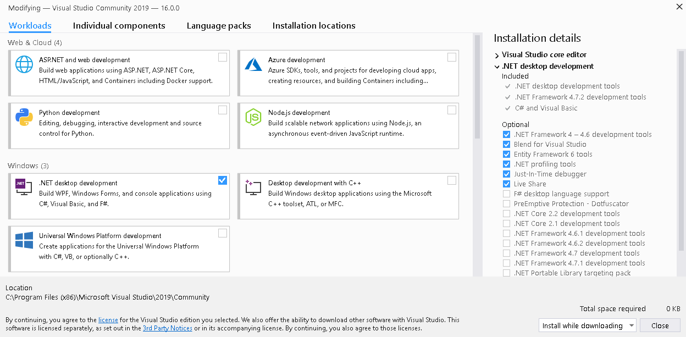

.. note::

  If you are running through this lab using Nutanix Frame, Visual Studio Community Edition has already been installed and configured for you.  Please also note that in a Nutanix Frame environment, Visual Studio **Code** is also installed.  This lab requires Visual Studio **Community Edition**.

Project Location
................

You can store your project files anywhere you like.  To keep things consistent, we will use a folder named `csharp_api_lab`.  This folder will be referred to as the **project folder** throughout this lab.

- Create a folder named `csharp_api_lab`, making sure you have write permissions to that folder.

Code Practices
--------------

One thing to note is that  this lab is an intro for C# consumption of the Nutanix REST APIs, there are a wide number of approaches to code standards.

So that we have a reference, the form controls we'll add shortly will be named based on the Wikibooks_ C# Programming Naming standard.  If you have a preferred naming standard you'd like to use, please feel free to use it provided the relevant control and variable name changes are made throughout the application code.

.. _Wikibooks: https://en.wikibooks.org/wiki/C_Sharp_Programming/Naming

Project Creation
----------------

- Open Visual Studio Community Edition.  If this is the first time you have opened the app, you will be asked to sign in with your Microsoft account.
- With Visual Studio Community Edition open, get started by creating a new Windows Forms app (.NET Framework)

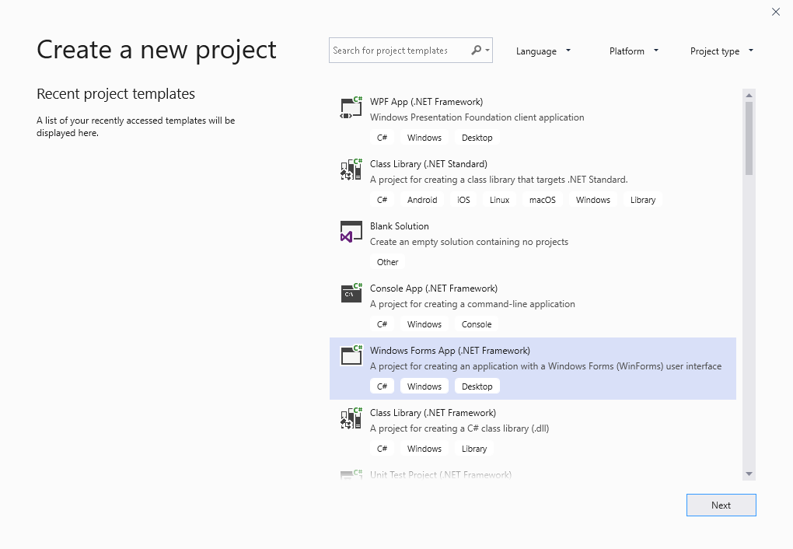

- The screenshots and demos in this lab refer to a project named **csharp_api_lab**
- The screenshots and demos in this lab store all files in **c:\\lab\\csharp_api_lab**
- **.NET Framework 4.7.2** is the latest version at the time of writing this lab

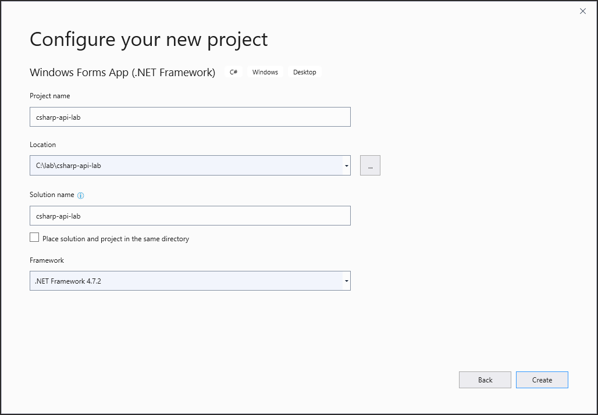

App Dependencies
................

With our application now created, the first requirement is to add the single external required dependency.

- Click View > Other Windows > **Package Manager Console**
- Paste the command below into the **Package Manager Console** and press Enter

.. code-block:: bash

  Install-Package Newtonsoft.Json -Version 12.0.1

- The Newtonsoft JSON package makes it very easy to read and format the JSON responses returned from our API requests.  We could this manually, but the existence of packages like these means we don't have to.
- A successful package installation for our project will look like the screenshot below.

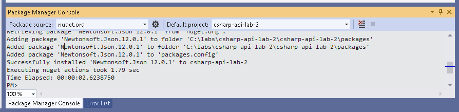

At this point we have an empty app with no "code".  No code that does anything useful, at least!

The next steps, for those new to Windows Forms development, are to start adding our form elements - labels, text boxes, etc.  These work as the user input and display elements for our application.

Let's add all our form elements now so that we can move on to wiring them up i.e. adding code to respond to user actions.

Creating Form Elements
......................

Our lab application is a single form since it is all we need to demonstrate the required concepts.  After adding all form elements, we'll have a form that looks something like this:

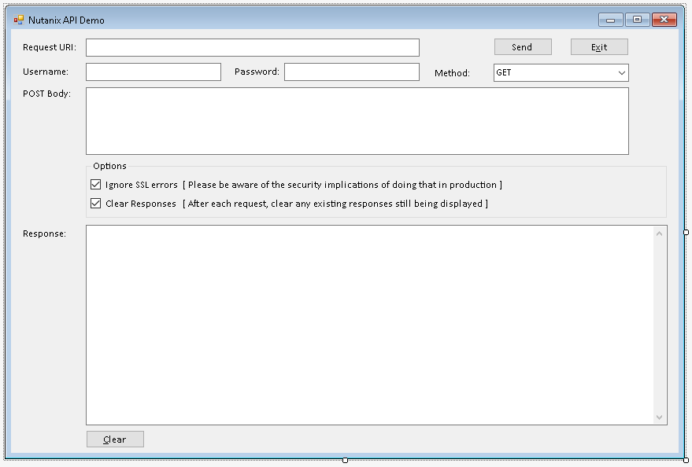

.. note::

  As we wire up and add events to each control that needs it, we'll also go into more detail about what each control does.

A couple of other things to note:

- The way you lay the elements out on the form is completely up to you i.e. the screenshot above is just a guide
- The only requirement, if you are following the lab or copying and pasting code from the lab is that your form elements have the same **names** as the elements we use here
- The form's UI can utilise any fonts or style you like i.e. the form shown here is just an example

Let's begin.

- If you don't see it already, click View > **Toolbox**.  All the controls we need are in the default toolbox and can be dragged straight onto the form
- On the right-side of the **Solution Explorer** you'll see **Form1.cs**
- Double-click **Form1.cs** and note that, by default, you are taken to the form's design view.  This is where we'll add our controls.
- Following the screenshots below, please now add controls that match what you see below.

**Labels**

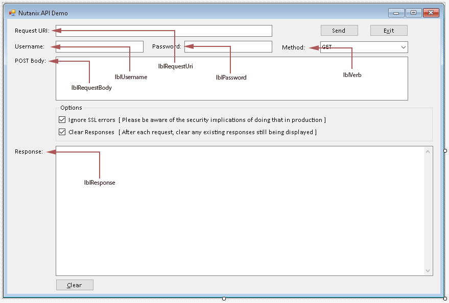

**Text Boxes**

.. note::

  The two large text boxes will only allow a single line of text by default.  We'll fix that later, at which time we'll also resize them.

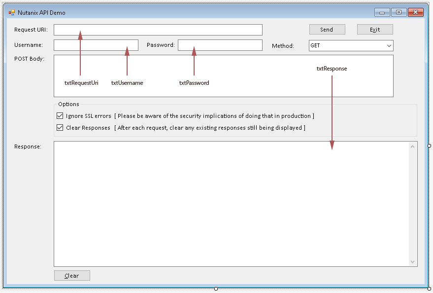

**Check Boxes**

.. figure:: images/05_form_layout_checkboxes.png

.. note::

  The sample form shows the checkboxes contained within a **GroupBox**.  This is entirely optional and simply serves to tidy up our form.

**Buttons**

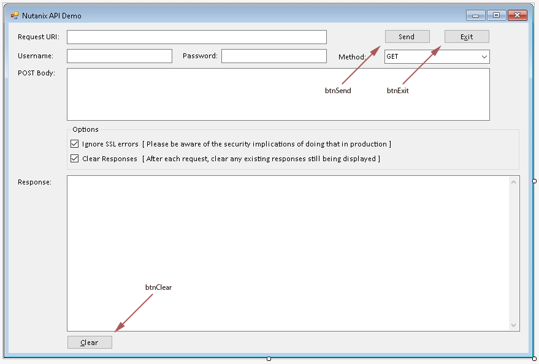

**Others**

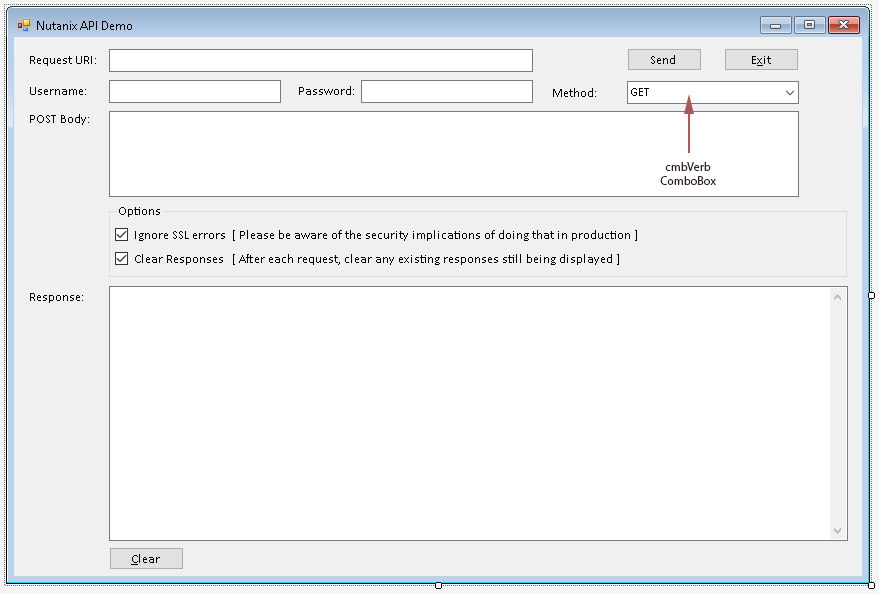

**Complete Form (Repeat)**

With all our form elements in place and assuming you're following along with this lab, your form should look something like this, remembering that the large textboxes will not yet be resizeable:

Adding Custom Classes
---------------------

While these custom classes could be wrapped into other part of our app's code, future labs may build on the structure we use here.  For this reason, we'll add a couple of custom classes now that can be used later.

RequestResponse.cs
..................

- In the Solution Explorer, right-click the **csharp_api_lab** project (not the solution), click **Add** and select **New Item**
- Select **Class**
- Name the class **RequestResponse.cs** and click **Add**
- Set the content of the class as follows

.. note::

  The RequestResponse class, for the timebeing, will be used to manage the responses that are returned from our API requests.

.. code-block:: c

  /*
   * basic class to handle the responses returned by our API requests
   * this isn't strictly required but does setup the app for a reasonably usable structure later
   *
  */

  namespace csharp_api_lab
  {
      class RequestResponse
      {

          public int Code { get; set; }
          public string Message { get; set; }

      }
  }

NutanixCluster.cs
.................

- In the Solution Explorer, right-click the **csharp_api_lab** project (not the solution), click **Add** and select **New Item**
- Select **Class**
- Name the class **NutanixCluster.cs** and click **Add**
- Set the content of the class as follows

.. note::

  The NutanixCluster class is provided for purposes that will be used in future labs.  For now, we're only using it to store the Nutanix cluster name and version, since those are the only values we're actively looking for during a request.

.. code-block:: c

  /*
   * basic class to cover very high-level Nutanix cluster details
   * this isn't strictly required but does setup the app for a reasonably usable structure later
  */
  namespace csharp_api_lab
  {
      class NutanixCluster
      {

          public string Name { get; set; }
          public string Version { get; set; }

      }
  }

RESTClient.cs
.............

- In the Solution Explorer, right-click the **csharp_api_lab** project (not the solution), click **Add** and select **New Item**
- Select **Class**
- Name the class **RESTClient.cs** and click **Add**
- Set the content of the class as follows

.. note::

  The RESTClient class is where we'll do the "heavy lifting" i.e. carrying out the actual API requests.  It has properties for things like connection credentials, the URL of the API request and a **SendRequest** method that will take the class properties and complete the API request before returning the results to the class instance.

.. code-block:: c

  /*
   * basic class to handle the actual API request
   *
  */

  using System;
  using System.IO;
  using System.Net;
  using System.Text;

  namespace csharp_api_lab
  {

      class RESTClient
      {

          public string EndPoint { get; set; }
          public string HttpMethod { get; set; }
          public string RequestBody { get; set; }
          public string Username { get; set; }
          public string Password { get; set; }
          public bool IgnoreSslErrors { get; set; }

          public RESTClient()
          {
              
          }

          public RequestResponse SendRequest()
          {

              /*
               * check to see if the user has specified to ignore SSL warnings
               * this is BAD in production - just don't do it
               * 
               * for the purposes of this demo, many Nutanix clusters will still use self-signed certificates
               * if SSL errors are not ignored, connections will be refused since we aren't automatically accepting self-signed certs in this app
              */
              if ( IgnoreSslErrors == true )
              {
                  ServicePointManager.ServerCertificateValidationCallback = ((sender, certificate, chain, sslPolicyErrors) => true);
                  ServicePointManager.Expect100Continue = true;
                  ServicePointManager.SecurityProtocol = SecurityProtocolType.Tls12;
              }            

              RequestResponse Response = new RequestResponse();
              HttpWebResponse HttpResponse = null;

              try
              {

                  var request = (HttpWebRequest)WebRequest.Create(EndPoint);
                  request.Method = HttpMethod;

                  /*
                   * this section only applies if the user as selected to send a POST request
                   * if the POST method is selected, we also need to process and send the POST body
                  */
                  if (HttpMethod != "GET")
                  {
                      var requestBody = Encoding.ASCII.GetBytes(RequestBody);
                      var newStream = request.GetRequestStream();
                      newStream.Write(requestBody, 0, requestBody.Length);
                      newStream.Close();
                  }

                  /*
                   * setup the request headers
                   * 
                   * for this app, we are only worried about the authentication type (Basic)
                   * and the valid encoding (application/json for Nutanix clusters)
                  */
                  String authHeader = System.Convert.ToBase64String(System.Text.ASCIIEncoding.ASCII.GetBytes(Username + ":" + Password));
                  request.Headers.Add("Authorization", "Basic " + authHeader);
                  request.Headers.Add("Accept-Encoding", "application/json");
                  request.ContentType = "application/json";
                  request.Accept = "application/json";

                  /*
                   * make sure the request doesn't sit there forever ...
                   * set this to a more appropriate value if accessing API URIs over slow/high-latency connections (e.g. VPN)
                  */
                  request.Timeout = 5000;

                  HttpResponse = (HttpWebResponse)request.GetResponse();
                  using (Stream HttpResponseStream = HttpResponse.GetResponseStream())
                  {
                      if (HttpResponseStream != null)
                      {
                          using (StreamReader reader = new StreamReader(HttpResponseStream))
                          {
                              Response.Code = 1;
                              Response.Message = reader.ReadToEnd();
                          }
                      }
                  }
              }
              catch( Exception ex )
              {
                  Response.Code = 99;
                  Response.Message = "{\"errors\":[\"" + ex.Message.ToString() + "\"]}";
              }
              finally
              {
                  if(HttpResponse != null)
                  {
                      ((IDisposable)HttpResponse).Dispose();
                  }
              }

              return Response;
          }

      }
  }

.. note::

  When you add the **RESTClient.cs** class, a number of lines in the class will appear underlined, indicating that there are syntax errors in the class.  That's OK for now as we'll fix it in the next step.

Adding 'Using' Dependencies
---------------------------

As with most languages, C# allows the ability to quickly add dependencies (includes) to any class that needs them.  C#, because that's what our app is written in, does this via the 'using' statement.

- When we added our controls, double-clicking the form opened the design view.  Do that now and then press **F7** to be view the form's code.
- At the top of **Form1.cs**, note the default **using** statements:

.. code-block:: c

  using System;
  using System.Collections.Generic;
  using System.ComponentModel;
  using System.Data;
  using System.Drawing;
  using System.Linq;
  using System.Text;
  using System.Threading.Tasks;
  using System.Windows.Forms;

In the code view, you'll also notice that all using statements except the last one are shown in a lighter colour.  This indicates they aren't required because the app doesn't currently contain any code that needs them.

- Here are the includes that we need in **Form1.cs**:

.. code-block:: c

  using System;
  using System.Windows.Forms;
  using Newtonsoft.Json;
  using System.IO;
  using System.Text.RegularExpressions;
  using System.Drawing;

Note the third include - **Newtonsoft.Json**.  This is where we reference the dependency added in the Package Manager Console earlier in the lab.

- The **Form1.cs** constructor, i.e. **public Form1()**, currently only contains the required code to initialise the form's components.  Add the following block underneath that line so that the entire constructor looks like this:

.. code-block:: c

  public Form1()
  {
      InitializeComponent();
      // set the dropdown box so text can't be manually entered
      this.cmbVerb.DropDownStyle = ComboBoxStyle.DropDownList;
  }

Those with experience in Windows Forms development may be wondering ... why aren't we just setting the relevant **cmbVerb** property instead of doing this programatically?  In our app, we'll shortly be adding the selectable options to the dropdown box on our form.  However, we also want to set the default value of that dropdown box.  In Visual Studio, setting the **DropDownList** property **at design time** will disable the ability to set the **Text** property of the control.  To get around this, we are setting the **Text** property in the form designer and then using code to disable the user's ability to manually enter text into the control.

Adding Custom Methods
---------------------

Throughout our app, we'll also be calling on a couple of custom methods to carry out various tasks.  Because we're only creating a basic app, we'll keep those in **Form1.cs**.

DisplayResponse
...............

- In **Form1.cs**, underneath the constructor, add the following **DisplayResponse** method.

.. note::

  DisplayResponse takes a string, runs it through the JsonPrettify method and adds the result to the **txtResponse** textbox.  While it is bad practice to do so in production, any exceptions generated by this action are caught and exception details returned, instead.

.. code-block:: c

  /**
   * take a string, run it through JsonPrettify and show the response in the txtResponse textbox
  */
  private void DisplayResponse(string DebugText)
  {
      try
      {
          txtResponse.Text = txtResponse.Text + JsonPrettify(DebugText) + Environment.NewLine + Environment.NewLine;
          txtResponse.SelectionStart = txtResponse.TextLength;
          txtResponse.ScrollToCaret();
      }
      catch( Exception ex )
      {
          txtResponse.Text = txtResponse + ex.Message.ToString() + Environment.NewLine;
      }
  }

Visual Studio's code completion and syntax checking is excellent and almost immediate, so you'll an indication that **JsonPrettify** does not exist in the current context.  This is because we haven't added the method, yet - we'll do that next.

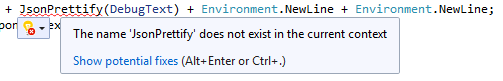

JsonPrettify
............

- In **Form1.cs**, underneath the **DisplayResponse** method, add the following **JsonPrettify** method.

.. code-block:: c

  /**
   * Take a JSON-formatted string and "prettify" it i.e. insert new line and tab characters where appropriate
   * from https://stackoverflow.com/questions/2661063/how-do-i-get-formatted-json-in-net-using-c
  */
  public static string JsonPrettify(string json)
  {
      using (var stringReader = new StringReader(json))
      using (var stringWriter = new StringWriter())
      {
          var jsonReader = new JsonTextReader(stringReader);
          var jsonWriter = new JsonTextWriter(stringWriter) { Formatting = Formatting.Indented };
          jsonWriter.WriteToken(jsonReader);
          return stringWriter.ToString();
      }
  }

Control Configuration
---------------------

The controls as they stand now are essentially default.  We haven't set any custom properties or made any required changes.  In the next step we'll make changes to the some of the controls since some of them won't do what we want in their default state.

In most cases the changes outlined below will be made in the **Properties** window.  If a change is made elsewhere, it will be detailed when appropriate.  If a control is not listed below, customisation beyond the default values is not required.

- If you aren't currently in design view, double-click **Form1.cs** in the Solution Explorer

txtPassword
...........

- Set **PasswordChar** to the asterisk character (*)

cmbVerb
.......

- Set the **Text** property to **GET**
- Set the **Items** collection property so that it contains **GET**, **POST**, **PUT** and **DELETE**.  This is done by clicking the ellipsis (...) button next to the **Items** value, shown as **(Collection)**

txtRequestBody
..............

- Set the **Multiline** property to **True**
- Set the **Enabled** property to **False**
- Use the drag handles to resize the control to fit more than 1 line of text

chkIgnoreSSLErrors
..................

- Set the **Checked** property to **True**

chkClearResponses
.................

- Set the **Checked** property to **True**

txtResponse
...........

- Set the **Multiline** property true
- Use the drag handles to resize the control to fit more than 1 line of text

Event Management
----------------

While this will be 101 information for those with Visual Studio experience, it has been included for those with little to no exposure to Visual Studio.  This intro section can be skipped if you have Visual Studio experience - pick up the lab again where we add events to **txtRequestUri**.

As of now, the application will build and run without issues.  However, we haven't added the ability for the application to "respond" to anything.  For example, what happens when a user clicks the **Send** button?  Or the **Clear** button?  That's right - nothing happens.  Pressing **F5** will build and run the app - do this now, if you'd like to see for yourself.

Each control has associated events that can be triggered when certain actions are executed or detected.  For example the **txtRequestUri** textbox, amongst many others, has an event named **TextChanged**.  The name suggests exactly what the event does, and you'd be right in thinking it gets triggered whenever the contents of the **txtRequestUri** textbox changes.

In addition, most controls will have a "default" event.  Think of the default event as the one you can modify by double-clicking the control on the form.  Within Visual Studio, in the **Properties** panel, you'll also see the **Events** button:

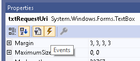

Clicking that button will show all available events associated with the currently selected control.

txtRequestUri - On text change
..............................

For the first example, we'll add the event the long way.  For subsequent controls we'll add the events using the "default" event i.e. by double-clicking the control.

- Select the **txtRequestUri** control on the form
- Click the **Events** button in the **Properties** window
- Scroll through the list of events until you see **TextChanged**
- Double-click the empty area to the right of **TextChanged**
- You'll be taken to a new method named **txtRequestUri_TextChanged** automatically added by Visual Studio
- Add the following code to the **txtRequestUri_TextChanged** method.

.. note::

  The code below will "watch" for changes to the contents of txtRequestUri.  When that event is triggered, the contents of the textbox will be compared via regular expression to ensure the format matches a typical URI.  If the text is a typical URI, the text will be shown in black and the **Send** button enabled.  If the text is not a typical i.e. does not match the regular expression, the text will be shown in red and the **Send** button disabled.

.. code-block:: c

  /*
   * perform a simple RegEx check to make sure a valid URI has been entered
  */
  string pattern = @"^(https?)\:\/\/[0-9a-zA-Z]([-.\w]*[0-9a-zA-Z])*(:(0-9)*)*(\/?)([a-zA-Z0-9\-\.\?\,\'\/\\\+&amp;%\$#_]*)?$";
  string text = txtRequestUri.Text;

  Regex r = new Regex(pattern);
  if (r.IsMatch(text))
  {
      /* URI is valid */
      txtRequestUri.ForeColor = Color.Black;
      btnSend.Enabled = true;
  }
  else
  {
      /* URI is invalid */
      txtRequestUri.ForeColor = Color.Red;
      btnSend.Enabled = false;
  }

btnExit - On click
..................

- Double-click the **btnExit** button control
- Add the following code to the new **btnExit_Click** method added by Visual Studio

.. note::

  The code below does one simple thing - quits the app when the **Exit** button is clicked.

.. code-block:: c

  /* quit the application */
  Application.Exit();

btnClear - On click
...................

- Double-click the **btnClear** button control
- Add the following code to the **btnClear_Click** method added by Visual Studio

.. note::

  The code below clears any previous responses or text from the **txtResponse** multiline textbox above it.

.. code-block:: c

  /* clear any responses that are still on screen */
  txtResponse.Text = "";

cmbVerb - On change
...................

- Double-click the **cmbVerb** Combobox control
- Add the following code to the **cmbVerb_SelectedIndexChanged** method added by Visual Studio

.. note::

  The code below checks to see which HTTP Method has been selected in the **cmbVerb** Combobox.  If the method is **GET**, the **txtRequestsBody** multiline textbox is disabled since our app does not require a request body for the GET method.  If the method is anything other than **GET**, the **txtRequestBody** textbox is enabled so that a JSON payload can be entered.

.. code-block:: c

  if (cmbVerb.Text == "GET")
  {
      txtRequestBody.Enabled = false;
  }
  else
  {
      txtRequestBody.Enabled = true;
  }

btnSend - On click
..................

At this point we have added a number of events to our app.  We still aren't sending any API requests, though, since we haven't yet wired any events that are triggered by the **btnSend** button.

Let's do that now.

- Double-click the **btnSend** button control
- Add the following code to the **btnSend_Click** method added by Visual Studio

.. note::

  The btnSend button is how we trigger a real API request from our app.  We're clearing previous responses, if the user has checked the btnClear checkbox.  We are then instantiating the RESTClient class, at which time we get the URL for the request as well as the chosen method for the request.  We are also getting the request body (payload) but won't be doing anything with it unless the user has specified a POST, PUT or DELETE request.  Properties are then gathered, e.g. credentials, we are sending the request and then displaying the results via the DisplayResponse method.  You'll also notice that we are checking the response to see if the request URL contains "/api/nutanix/v2.0/cluster".  If it does, there's an assumption that the user is looking for cluster info, at which time we'll also instantiate the NutanixCluster class and grab the cluster name and version from the response.

.. code-block:: c

  /* keep previous responses?  if not, clear any that are still showing */
  if (chkClearResponses.Checked)
  {
      txtResponse.Clear();
  }

  /*
   * instantiate our RESTClient class
   * this will hold all properties relevant to the request we're sending, then processing
   * 
  */
  RESTClient RestClient = new RESTClient()
  {
      EndPoint = txtRequestUri.Text,
      HttpMethod = cmbVerb.Text,
      RequestBody = txtRequestBody.Text != "" ? txtRequestBody.Text : "GET"
  };

  /* get the basic properties of the request */
  RestClient.Username = txtUsername.Text;
  RestClient.Password = txtPassword.Text;
  RestClient.IgnoreSslErrors = chkIgnoreSSLErrors.Checked;
  RequestResponse Response = new RequestResponse();
  DisplayResponse("{\"event\":\"Sending request ...\"}");

  /* send the actual request */
  Response = RestClient.SendRequest();

  /* process the returned response, along with any errors that may have occurred */
  DisplayResponse(Response.Message);
  DisplayResponse("{\"event\":\"Request completed\"}");

  /*
   * because this is written with Nutanix API demos in mind (as one use),
   * check to see if the API request URI is a request for Nutanix cluster details
   * this is completely ignored for any requests that aren't aimed at a Nutanix cluster
   * 
   * this is a total hack, but gets the job done for the purposes of this demo  ;)
  */
  if (txtRequestUri.Text.ToLower().Contains("/api/nutanix/v2.0/cluster"))
  {
      NutanixCluster cluster = JsonConvert.DeserializeObject<NutanixCluster>(Response.Message);
      DisplayResponse("{\"cluster\":{\"name\":\"" + cluster.Name.ToString() + "\",\"version\":\"" + cluster.Version.ToString() + "\"}}");
  }

Testing Our App
---------------

All our form controls are now customised and the relevant events have had the appropriate code added.  With that done, it's time to test the app for the first time.

- If you haven't done so yet, or if you're new to Windows Forms/Visual Studio development, **Ctrl-Shift-B** can be used to build the application.  Do this now and make sure there are no code syntax errors in the app.

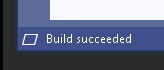

- If the build fails, Visual Studio will give detailed information about what went wrong.  The lab provides code that has been tested and, provided form controls have been named the same as those documented above, the app should build without issue.
- If the build is successful, **F5** can be used to run the app.  This will show the main form, at which time we can carry out a complete test.

At this point you will need access to a Nutanix Cluster in order to complete the test.  The application has only been tested against Nutanix clusters, including Nutanix Community Edition 5.9 or later.

- With the application running, let's use the request URL above to test.  Enter the URL as **https://<cluster_ip>:9440/api/nutanix/v2.0/cluster** (replace **<cluster_ip>** with your cluster virtual IP address or the IP address of one of your CVMs)
- Enter your cluster credentials
- Make sure the method is set to **GET**
- Click **Send**

If there are no connectivity issues and if the credentials are correct, you'll see the cluster name and version shown in the **txtResponse** multiline textbox.  For example:

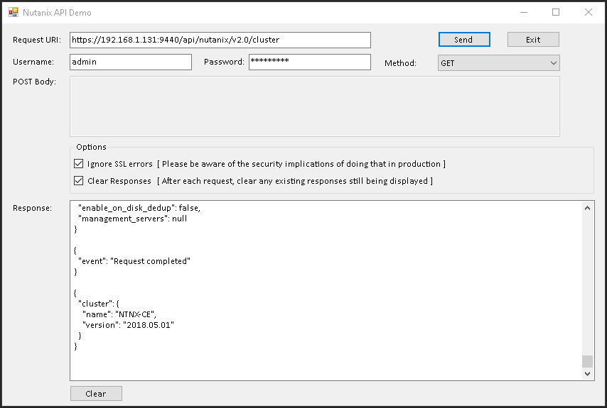

At the bottom of the **txtResponse** textbox, the cluster name **NTNX-CE** and version **2018.05.01** are shown.

Now let's test a POST request to the Nutanix v3 APIs.

.. note::

  For this test your cluster will need to be running a recent version of Nutanix AOS.  Testing for this lab was carried out using AOS 5.10.

- With our application still running, enter **https://<cluster_ip>:9440/api/nutanix/v3/vms/list** as the **Request URI** (replace **<cluster_ip>** with your cluster virtual IP address or the IP address of one of your CVMs)
- Enter your cluster credentials
- Make sure the method is set to **POST**
- Note that the **txtRequestBody** textbox is now enabled and can take user input
- Enter the following as the body:

.. code-block:: json

  {"kind":"vm"}

- Click **Send**

If there are no connectivity issues and if the credentials are correct, you’ll see the a JSON response in the **txtResponse** textbox, detailing all VMs that are available to be listed from your cluster.  For example:

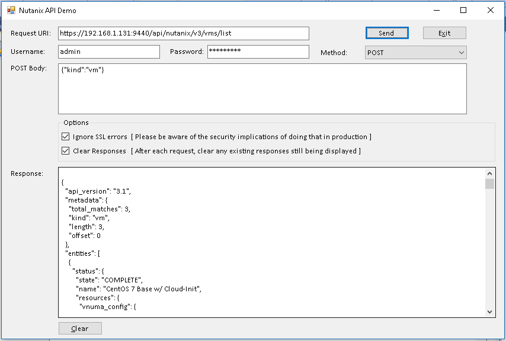

Wrapping Up
-----------

If you've gotten this far, you've successfully created a Windows Forms .NET application from scratch, complete with form controls and events that carry out and process a Nutanix REST API request.  We've tested the application with a **GET** request to show getting cluster information and also tested a **POST** request to show how a JSON payload can be used with the Nutanix REST APIs.

The takeaways from this lab are simple.  The Nutanix REST APIs can be consumed from any language or script capable of sending a REST API request, the results of which can then be processed in any way you see fit.  In our example, we're only showing the results directly, but packages like **Newtonsoft.JSON** could easily be used to carry out all sorts of custom processing.

Thanks for taking this lab!

Lab Resources
-------------

Similar to this Windows Forms app lab, we also have a growing collection of labs that demonstrate similar concepts from other languages.  Please see the Nutanix Developer Portal Labs_ page for more info.

.. _Labs: https://developer.nutanix.com/labs

Final Thoughts
--------------

For further information on the Nutanix REST API versions and the data that is exposed by them, please see the Nutanix Developer Portal_.  There will you find code samples, documentation and information on everything from the APIs we used today (v1 and v2.0) through to v3 APIs, the current "intentful" API implementation.

For additional information on the Nutanix APIs, including the current API reference, please see:

- Nutanix Developer Portal_
- What are the Nutanix REST API versions_ and what does each one do?

.. _versions: https://developer.nutanix.com/2019/01/15/nutanix-api-versions-what-are-they-and-what-does-each-one-do/
.. _Portal: https://developer.nutanix.com
