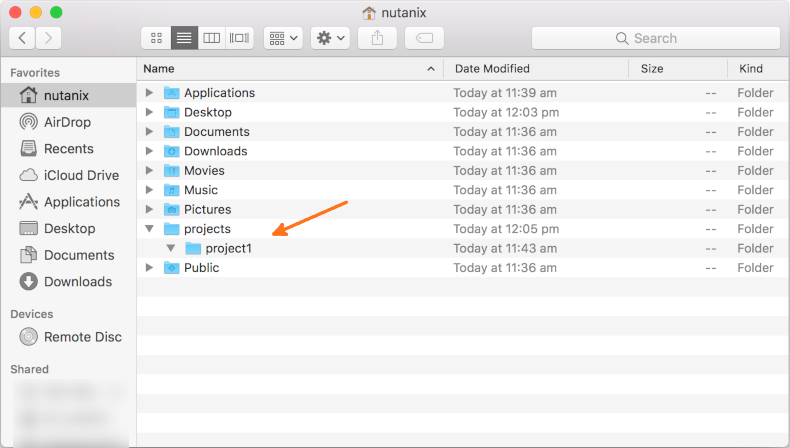

----------------------------
Nutanix Python Reporting Lab
----------------------------

Overview
++++++++

**Estimated time to complete: 60-120 MINUTES**

The Nutanix Python Reporting Lab will cover a few key points.

- Python + Nutanix API Intro
- Walk-through of creating a detailed Prism Central HTML report generator, via Prism Central API

This lab can be followed relatively quickly simply by copying and pasting the code samples.  However, it is suggested each section be examined so you can gain the best possible understanding of what the script is doing.

.. note::

   If you are yet to setup your PC/laptop with the development tools recommended for these labs, please see the `Nutanix Developer Setup Lab <https://nutanix.dev/labs>`_ for detailed instructions on how to do so.  The setup lab covers everything from project structure to languages, tools and recommended utilities.

Complete Example
++++++++++++++++

While it is **strongly** recommended to follow this lab in its entirety, a `complete and functioning example <https://github.com/nutanixdev/code-samples/tree/master/python/get_cluster_info_v3>`_ has been made available on the `NutanixDev Github <https://github.com/nutanixdev/code-samples/>`_ code samples repo.

This lab is, however, designed to take you through the end-to-end build of this script and the accompanying parts and will explain, in detail, how many of the script works.

How to Follow this Lab
++++++++++++++++++++++

Each lab section is broken into sub-sections, one for each of the supported operating systems.

For the supported operating systems, i.e. Ubuntu Linux, Mac OS X and Windows 10, appropriate steps have been included where necessary.

Required Steps
..............

When a section requires you to carry out specific ordered steps, or explains various steps in detail, each step will be bullet-pointed:

- Step 1
   - Sub-task within step 1
- Explanation 1
- Explanation 2
- Step 2
- Step 3
   - Sub-task within step 3

Additional Notes
................

A specific section's related details or important information will be shown as a highlighted note:

.. note::

   This is a note, and should be read as accompanying information for the section or step above.

Code Samples
............

Many sections and steps through the Nutanix Developer labs will be accompanied with code samples or code you should copy & paste, or add to a file.  When a code block relates to a specific section or step, it will be included/indented as part of the section or step contents.  An example is shown below.

- Step 1 has related code below:

   .. code-block:: python

      #!/usr/bin/env python
      print('This code relates to step 1.')
      print('Kthxbye!')

- Step 2 has no related code
- Step 3 has no related code

.. code-block:: python

   #!/usr/bin/env python
   print('This is a code block that does not belong to a specific step.')
   print('Note the indentation i.e. this code is not indented under step 3.')

Copying Code Samples
....................

The code samples in the Nutanix Developer labs, as outlined above, as provided with a single-click copy button.  Moving your mouse over any code sample will show a copy button at the top-right of the code sample window.  A **screenshot** is shown below; note the copy button shown at the top-right of the code sample window:

Please make sure to use this button when copying code samples as it will ensure the code is copied to your clipboard without modification and in a format suitable for pasting into your editor.

Editors
.......

Steps are included based on Visual Studio Code and Sublime Text 3, although you are welcome to use any editor you have available in your environment.

Let's get started.

Project Structure
+++++++++++++++++

- Ensure you have created a directory/folder to hold your project.  This lab assumes you have created a folder named **projects** in your user's home directory, containing a sub-directory named **python_reporter**.  In order, Ubuntu Linux (GNOME), Mac OS X (Finder) and Windows (Explorer) examples are shown below:

.. figure:: images/linux_gui_filesystem.png

Add project folder to the editor
++++++++++++++++++++++++++++++++

- Open the project in your selected editor.

Visual Studio Code
------------------

- After opening Visual Studio Code, click the **File** menu and select **Add Folder to Workspace...**
- Browse to the **projects/python_reporter** folder that you created in the step above
- Click **Add**

  Screenshots for Linux, OS X and Windows, respectively, are shown below.

  .. figure:: images/linux_vscode_add_folder_to_workspace.png

  .. figure:: images/osx_vscode_add_folder_to_workspace.png

  .. figure:: images/windows_vscode_add_folder_to_workspace.png

Sublime Text 3
--------------

- After opening Sublime Text 3, click the **Project** menu and select **Add Folder to Project...**
- Browse to the **projects/python_reporter** folder that you created in the step above
- Click **Open**

  Screenshots for Linux, OS X and Windows, respectively, are shown below.

  .. figure:: images/linux_st3_add_folder_to_project.png

  .. figure:: images/osx_st3_add_folder_to_project.png

  .. figure:: images/windows_st3_add_folder_to_project.png

Virtual Environment
+++++++++++++++++++

When setting up a Python development environment it is highly recommended to use the **venv** module - Virtual Environment.

From the official Python `venv <https://docs.python.org/3/library/venv.html>`_ documentation:

  .. note::  The venv module provides support for creating lightweight "virtual environments" with their own site directories, optionally isolated from system site directories. Each virtual environment has its own Python binary (which matches the version of the binary that was used to create this environment) and can have its own independent set of installed Python packages in its site directories.

For this lab, we'll use a virtual environment to ensure our development efforts are isolated as outlined above.  Let's get started.

Python Paths
............

When setting up the virtual environment below, it is necessary to use the **system** Python installation.  Following that, the Python executable will change to the one made available via the virtual environment.  The sections below outline where these executables can commonly be found, especially when following the Nutanix Developer labs.

Python Paths - System
=====================

When to use: When a Python virtual environment **is not activated**.

- **Linux**: /usr/bin/python3.7
- **Mac OS X**: /usr/local/bin/python3.7 or /Library/Frameworks/Python.framework/Versions/3.7/bin/python3.7 (either will work for the upcoming steps)
- **Windows 10**: C:\\tools\\python37\\python.exe

The paths above are also the location of the 'pip3' and 'pip' binaries, referenced later in this lab.

  .. note::  The Windows 10 path above assumes you have installed Python 3.7 by following the `Nutanix Developer Setup Lab <https://nutanix.dev/labs>`_.  This path also applies to labs being run within a Nutanix Frame session.

Python Paths - Virtual Environment
==================================

When to use: When a Python virtual environment **is activated**.

After the virtual environment has been created and activated, the paths will **change** to the following.  The path changes because each virtual environment, as outlined above, contains its own Python 3.7 binary/executable.  This ensures installed packages and modules do not interfere with the system-wide Python installation.

For the purposes of this lab, **<venv>** refers the virtual environment directory.

- **Linux**: <venv>/bin/python3.7
- **Mac OS X**: <venv>/bin/python3.7
- **Windows 10**: <venv>\\Scripts\\python.exe

The paths above are also the location of the 'pip3' and 'pip' binaries, referenced later in this lab.

**Throughout this lab, the Python 3.7 binary will be referred to simply as 'python3.7' and pip simply as 'pip3'.**

Creating & Activating Virtual Environment
=========================================

- Open your terminal application.

   - **Terminal** for Ubuntu Linux and Mac OS X
   - **Windows PowerShell** for Windows 10

- Create and activate a new virtual environment by running the appropriate command below.  Python should be in your system's PATH but, if not, please see the paths section above for information on binary/executable location.

Linux
.....

.. code-block:: bash

   cd ~/projects/python_reporter
   python3.7 -m venv venv
   . venv/bin/activate

OS X
....

.. code-block:: bash

   cd ~/projects/python_reporter
   python3.7 -m venv venv
   . venv/bin/activate

Windows 10/Frame
................

.. code-block:: PowerShell

   Set-Location $env:USERPROFILE\projects\python_reporter
   python -m venv venv
   venv\Scripts\activate

The **(venv)** indicator tells us we're working in a Python virtual environment.

Use of virtual environment
++++++++++++++++++++++++++

**We will be returning to the terminal on multiple occasions through this lab.  Do not close terminal/command prompt and make sure your virtual environment is activated at all times throughout this lab.

Deactivating Virtual Environment
++++++++++++++++++++++++++++++++

.. note::  Tip: When you are finished working on a Python project within a virtual environment, you should 'deactivate' the virtual environment.

**Please don't do this yet - it is for your information only.**

Linux & Mac OS X
................

.. code-block:: bash

   deactivate

Windows 10/Frame
................

.. code-block:: PowerShell

   venv\Scripts\deactivate.bat

Python Indentation
++++++++++++++++++

Python has very strict **indentation** requirements.  From a best-practice perspective, it is widely accepted (and expected!) that 4 spaces are used to indent code blocks.  If you want your code to be readable and to pass linting tool checks like **flake8** and **pylint**, stick to 4 spaces when indenting code.

Throughout this lab, it is important to keep an eye on where you are indenting each code block.  For example, consider the start of this demo function:

.. code-block:: python

   def do_something(self):
       print('This line of code is indented with 4 spaces.')

Then, later in the lab, you need to add the following code to the **do_something** function:

.. code-block:: python

   print('This line is part of the do_something function and is also indented with 4 spaces.')

Ignoring potential line-length warnings for the moment, it is **critical** that the **print** line above is placed at the **exact same** indentation level as the **print** line above it.

The **do_something** function then becomes:

.. code-block:: python

   def do_something(self):
       print('This line of code is indented with 4 spaces.')
       print('This line is part of the do_something function and is also indented with 4 spaces.')

Installing Dependencies
+++++++++++++++++++++++

setup.py
........

- In the project directory, create a new file called **setup.py**.  This assumes you have followed the `Nutanix Developer Setup Lab <https://nutanix.dev/labs>`_ and have installed either Visual Studio Code or Sublime Text 3.  This file will be used to install our dependencies i.e. the modules required for our script to run correctly.

Visual Studio Code
==================

- Right-click the **python_reporter** directory added to the workspace in an earlier step
- Select **New File**
- Enter **setup.py** as the name of the new file
- Press **Enter**

Sublime Text 3
==============

- Right-click the **python_reporter** directory added to the project in an earlier step
- Select **New File**
- Enter **setup.py** as the name of the new file
- Press **Enter**

- Copy and paste the code below into **setup.py**.

  .. code-block:: python

    from setuptools import setup, find_packages

    with open('readme.rst', encoding='UTF-8') as f:
        readme = f.read()

    setup(
        name='python-reporter',
        version='1.0',
        description='Use the Prism Central API to get Nutanix environment info.',
        long_description=readme,
        author='<your_name_here>',
        author_email='<your_email_address_here>',
        install_requires=[
            'requests',
            'urllib3'
        ],
        packages=find_packages('.'),
        package_dir={'': '.'}
    )

Explanation
===========

What are we doing here?  The top sections are fairly self-explanatory, i.e. they simply set the script name, version and some author information.

For our lab script, we're interested in the **install_requires** section as it tells Python that specific modules are required.

- **requests** - the standard way that (probably) most people will use for `making HTTP requests in Python <https://realpython.com/python-requests/>`_.
- **urllib3** - `another HTTP client for Python <https://urllib3.readthedocs.io/en/latest/>`_ that we'll use to completely disable insecure request warnings.

readme.rst
..........

- In the project directory, create a file named **readme.rst**.  This file contains information that will help others understand what the script does and how it works.  The content of this file are up to you, although a simple version is shown below.

  .. code-block:: rst

    Python Reporter
    ###############

    "As-built" documentation script for use with Nutanix **Prism Central** 5.5.0.6 or later.

    <Fill in complete details here, at your leisure>

  The `reStructuredText reference <http://docutils.sourceforge.net/rst.html>`_ can be used to learn the available RST options.

Explanation
===========

You'll notice in **setup.py** from the previous step that we're referencing **readme.rst** as follows:

.. code-block:: python

   with open('readme.rst', encoding='UTF-8') as f:
       readme = f.read()

When required, Python setup tools can display the contents of **readme.rst** in the **long_description** section.

Run setup.py
............

- Use **pip** (Package Installer for Python) as follows:

  .. code-block:: python

    pip3 install -e .

  .. figure:: images/install_deps.png

  As you can see from the screenshot above, our dependencies have been successfully installed and can now be used in our main script.

Script Creation
+++++++++++++++

Now that we have created and activated our development environment, created our readme documentation and installed dependencies via **setup.py**, we can create the lab script itself.

As we go through the create of this script, various parts will be highlighted and explained in more detail than others.

Best Practices
..............

When creating Python scripts, there are certain best practices that you may choose to follow.  Many of these are contained and documented within the `PEP8 Style Guide <https://www.python.org/dev/peps/pep-0008/>`_.

Our lab today will implement many of the best practices described there, although the choice regarding which to implement is up to you.

Create the script
.................

- In the project directory, create a new file called **python_reporter.py**.

Visual Studio Code
==================

- Right-click the **python_reporter** directory added to the workspace in an earlier step
- Select **New File**
- Enter **python_reporter.py** as the name of the new file
- Press **Enter**

Sublime Text 3
==============

- Right-click the **python_reporter** directory added to the project in an earlier step
- Select **New File**
- Enter **python_reporter.py** as the name of the new file
- Press **Enter**

Make script executable
......................

**This step is not required on Windows 10/Frame**

On Linux and Mac OS X systems, the script file should be executable.

- In the terminal, run the following commands.

    .. code-block:: bash

      cd ~/projects/python_reporter
      chmod u+x python_reporter.py

Docstring and Imports
.....................

At the top of **python_reporter.py** we need to start with a number of sections.

- A **shebang** that specifies which binary to use when running the script.  The shebang used in this lab is portable between Unix and Windows environments.
- A `Docstring <https://www.python.org/dev/peps/pep-0257/>`_ that describes what the script does.
- `Imports <https://docs.python.org/3/reference/import.html>`_ that tell Python which modules and libraries are required for the script to run
- For our script, add the following code to **python_reporter.py**:

  .. code-block:: python

    #!/usr/bin/env python

    '''
    Python >=3.7 script to generate a human-readable HTML
    report on a specified Nutanix Prism Central instance
    '''

    import os
    import os.path
    import sys
    import socket
    import getpass
    import argparse
    from time import localtime, strftime
    from string import Template

- As our dependencies are already installed, we can now add the **import** section that will make use of those dependencies.  This section will fail gracefully in the event an import fails.
- Add the following code block to **python_reporter.py**:

  .. code-block:: python

    try:
        import urllib3
        import requests
        from requests.auth import HTTPBasicAuth
    except ModuleNotFoundError as error:
        # Output expected ImportErrors.
        print(f'''
        {error.__class__.__name__} exception has been caught.
        This typically indicates a required module is not installed.
        Please ensure you are running this script within a
        virtual development environment and that you have run the
        setup script as per the readme. Detailed exception info follows:

        {error}
        ''')
        sys.exit()

Explanation
===========

As you can see, we are importing our dependencies - **urllib3** and **requests**.

If any of those imports fail, we are catching the **ModuleNotFoundError** exception that will typically be thrown, and returning a helpful message to the user.

Our only choice at that point is to terminate the script, since required modules have not been loaded correctly.

.. note:: If you are new to Python >= 3.6, note the **f** character at the start of our print statement.  This indicates the use of `Formatted string literals <https://docs.python.org/3/whatsnew/3.6.html#whatsnew36-pep498>`_, also known as *f-strings*.  This feature was released in Python 3.6 and is one of the reasons why this script isn't compatible with Python 2.x.  We can then enclose variables in **{curly_braces}** and have that variable or statement's value substituted in-place.  It is worth noting that f-strings can be a little divisive; some people seem to prefer the "older" formatting methods, but f-strings work perfectly for what we need here.

Custom exceptions & Environments
................................

Because this script is designed to be modular but also predictable, we're now going to add a custom exception and a Python class to hold environment-specific settings.

These environment specific settings are:

- The Prism Central IP address.
- Prism Central credentials.
- The timeout value for our API requests, in seconds.
- 'Debug mode' disabled or enabled.
- The maximum number of entities to expect in each request.
- The Prism Central **entities** that we support e.g. VM and Calm Blueprint.

This is being packaged this into a custom class so that modifying and extending the script is much easier later, if required.

.. note::  Tip: The PEP8 style guide referenced earlier specifies two blank lines be present before certain code blocks; classes is one of these blocks.

- Add our custom exception.  This exception can be modified later, at your convenience.

  .. code-block:: python

    class DetailsMissingException(Exception):
        '''
        basic custom exception for when things "don't work"
        this is something that has been added simply to make extending
        the script much easier later
        '''
        pass

- Add our **EnvironmentOptions** class.  By doing this, we are including the following steps:

  - Defining some default values for the `class instance variables <https://docs.python.org/3/tutorial/classes.html>`_.
  - Defining the default supported entities.
  - Including a best-practice **__repr__** function that returns a human-readable "version" of the class, should it be "printed".
  - Processing our command-line arguments with `Argparse <https://docs.python.org/3/howto/argparse.html>`_ (highly recommended reading!).
  - Add this class now:

  .. code-block:: python

    class EnvironmentOptions():
        '''
        this class is provided as an easy way to package the settings
        the script will use
        this isn't strictly necessary but does clean things up and removes
        the need for a bunch of individual global variables
        '''

        def __init__(self):
            self.cluster_ip = ""
            self.username = ""
            self.password = ""
            self.debug = False
            self.read_timeout = 10
            self.entity_response_length = 20
            # these are the supported entities for this environment
            self.supported_entities = ['vm', 'subnet', 'cluster', 'project',
                                      'network_security_rule', 'image',
                                      'host', 'blueprint', 'app']

        def __repr__(self):
            '''
            decent __repr__ for debuggability
            this is something recommended by Raymond Hettinger
            '''
            return (f'{self.__class__.__name__}(cluster_ip={self.cluster_ip},'
                    f'username={self.username},password=<hidden>,'
                    f'entity_response_length={self.entity_response_length},'
                    f'read_timeout={self.read_timeout},debug={self.debug})')

        def get_options(self):
            '''
            method to make sure our environment options class holds the
            settings provided by the user
            '''

            parser = argparse.ArgumentParser()
            '''
            pc_ip is the only mandatory command-line parameter for this script
            username and password have been left as optional so that we have
            the opportunity to prompt for them later - this is better for
            security and avoids the need to hard-code anything
            '''
            parser.add_argument(
                'pc_ip',
                help='Prism Central IP address'
            )
            parser.add_argument(
                '-u',
                '--username',
                help='Prism Central username'
            )
            parser.add_argument(
                '-p',
                '--password',
                help='Prism Central password'
            )
            parser.add_argument(
                '-d',
                '--debug',
                help='Enable/disable debug mode'
            )

            args = parser.parse_args()

            '''
            do some checking to see which parameters we still need to prompt for
            conditional statements make sense here because a) we're doing a few of
            them and b) they're more 'Pythonic'
            '''
            self.username = (args.username if args.username else
                            input('Please enter your Prism Central username: '))
            self.password = args.password if args.password else getpass.getpass()

            '''
            conditional statement isn't required for the Prism Central IP since
            it is a required parameter managed by argparse
            '''
            self.cluster_ip = args.pc_ip

            self.debug = True if args.debug == 'enable' else False

Handling API Requests
.....................

There are a number of approaches to handling reusable code, especially when scripts need to carry out similar actions multiple times.

For this lab, we are making multiple requests to the Nutanix Prism Central REST API.  Our API request code handles that, so we'll now package it into a reusable class.

- Add the following ApiClient class to **python_reporter.py**.  At the same time, we will add the **__init__** and **__repr__** functions.  These functions initialise the class and provide a function to show what the class looks like, if it is "printed".

**Be sure to indent the code block exactly as shown below!**

  .. code-block:: python

    class ApiClient():
        '''
        the most important class in our script
        here we carry out the actual API request and process the
        responses, as well as any errors that returned from the
        response
        '''

        def __init__(self, cluster_ip, request, body,
                     username, password, timeout=10):
            self.cluster_ip = cluster_ip
            self.username = username
            self.password = password
            self.base_url = f'https://{self.cluster_ip}:9440/api/nutanix/v3'
            self.entity_type = request
            self.request_url = f'{self.base_url}/{request}'
            self.timeout = timeout
            self.body = body

        def __repr__(self):
            '''
            decent __repr__ for debuggability
            this is something recommended by Raymond Hettinger
            '''
            return (f'{self.__class__.__name__}(cluster_ip={self.cluster_ip},'
                    f'username={self.username},password=<hidden>,'
                    f'base_url={self.base_url},entity_type={self.entity_type},'
                    f'request_url={self.request_url},'
                    f'body (payload)={self.body})')

The next section is the *real* reason this class exists - to make API requests.

- Add the following code block to the **ApiClient** class.

.. note::  Up until this point, the code you've added hasn't been indented further than the start of a line.  However, we are now adding code blocks that belong **inside** another code block.  The **send_request** function, added below, is a member of the **ApiClient** class and needs to be indented to indicate that.  When adding the code block below, indent the entire block at the same indentation level as the **__init__** and **__repr__** functions above.

.. code-block:: python

   def send_request(self):
       '''
       send the API request based on the parameters we
       have already collected
       '''

       headers = {'Content-Type': 'application/json; charset=utf-8'}
       try:
           api_request = requests.post(
               self.request_url,
               data=self.body,
               verify=False,
               headers=headers,
               auth=HTTPBasicAuth(self.username, self.password),
               timeout=self.timeout,
           )
       except requests.ConnectTimeout:
           print('Connection timed out while connecting to '
                   f'{self.cluster_ip}. Please check your connection, '
                   'then try again.')
           sys.exit()
       except requests.ConnectionError:
           print('An error occurred while connecting to '
                   f'{self.cluster_ip}. Please check your connection, '
                   'then try again.')
           sys.exit()
       except requests.HTTPError:
           print('An HTTP error occurred while connecting to '
                   f'{self.cluster_ip}. Please check your connection, '
                   'then try again.')
           sys.exit()
       except Exception as error:
           '''
           catching generic Exception will throw warnings if you
           are running the script through something like flake8
           or pylint
           that's fine for what we're doing here, though :)
           '''
           print(f'An unhandled exception has occurred: {error}')
           print(f'Exception: {error.__class__.__name__}')
           print('Exiting ...')
           sys.exit()

       if api_request.status_code >= 500:
           print('An HTTP server error has occurred ('
                   f'{api_request.status_code})')
       else:
           if api_request.status_code == 401:
               print('An authentication error occurred while connecting to '
                       f'{self.cluster_ip}. Please check your credentials, '
                       'then try again.')
               sys.exit()
           if api_request.status_code >= 401:
               print('An HTTP client error has occurred ('
                       f'{api_request.status_code})')
               sys.exit()
           else:
               print("Connected and authenticated successfully.")
        return api_request.json()

Explanation
===========

Now we'll take a look at the important parts of this code.  This next section is for explanation purposes only; there's no need to add these lines again.

- The first thing we do is set the **headers** for the request.  In this case we're setting **Content-Type** to **application/json**, since that's what the Prism Central REST APIs will respond with.

  .. code-block:: bash

     headers = {'Content-Type': 'application/json; charset=utf-8'}

- Then we send the request itself.  Note that the request parameters are based on the **ApiClient** class' instance variables, i.e. the specific request parameters collected earlier.

  .. code-block:: python

     try:
         api_request = requests.post(
         ...

- There are multiple reasons why an API request like this may fail, so it is important we are prepared for that.  This script only implements basic `exception handling <https://docs.python.org/3/tutorial/errors.html>`_, but does show how you can set this up in a real environment.

  .. code-block:: python

     except requests.ConnectTimeout:
         ...
         sys.exit()
     except requests.ConnectionError:
         ...
         sys.exit()

- We are also checking for *specific* HTTP response codes, e.g. 50x.  This typically means something went wrong on the server side.

  .. code-block:: python

     if api_request.status_code >= 500:
         ...

  .. code-block:: python

     if api_request.status_code == 401:
         # authentication error
         ...

- If no HTTP or API errors were thrown + caught, we're returning the JSON response so it can be further processed.

Progress Summary
................

With the script coming together, let's take a quick look back at what's been achieved so far.  We have:

- Created a virtual development environment
- Installed the script dependencies via **setup.py**
- Created the **python_reporter.py** script
- Looked at some of the best practices for writing Python code
- Added custom classes for custom exception handling, environment configuration and API requests

If we run our script now, it will **work** and shouldn't throw any errors, but won't do anything useful.  In fact, the script won't even show any output at this point.  That's because we haven't actually told it to, so let's prepare for that now.

HTML Generation
...............

The whole point of this script to make API requests, process the responses that relate to our Prism Central instance, and generate an HTML page from them.

- Add the following code-block to **python_reporter.py**.

  .. code-block:: python

    HTML_ROWS = {}
    ENTITY_TOTALS = {}

.. note::

  These variables are not part of any specific class and, therefore, don't need to be indented within any of our existing code.  From this point forward, keep an eye on your indenting and make sure your code is indented when it is part of a class or function.

- Add a new function named **generate_template** that accepts an API request in JSON format as a parameter:

  .. code-block:: python

    def generate_template(json_results):
        '''
        generate the HTML
        '''
        day = strftime('%d-%b-%Y', localtime())
        time = strftime('%H%M%S', localtime())
        now = f'{day}_{time}'
        html_filename = f'{now}_prism_central.html'

  We've collected the current date and time and used used those values to create an appropriate HTML filename.

- Add the following code block to the **generate_template** function.  This code sets us up to start processing the JSON response.

  .. note:: Test question - how should the code below be indented?  Is it part of an existing function?

  .. code-block:: python

    '''
    the next block parses some of the Prism Central info that
    currently exists as individual lists
    '''

    '''
    these are entity types the script currently supports
    if new features or entity types become available in future,
    it should be a relatively simple task to update this list
    to support those entities
    '''
    supported_entities = [
        'vm', 'subnet', 'cluster', 'project', 'network_security_rule',
        'image', 'host', 'blueprint', 'app']
    for row_label in supported_entities:
        HTML_ROWS[row_label] = ''
        ENTITY_TOTALS[row_label] = 0

    print('\n')

Explanation
===========

First, notice that we're sticking to our best practices and making sure Docstrings tell future readers what's going on.

The **supported_entities** list specifies the entities we'll be requesting/listing.  For example, if you don't care about subnets or projects, you could simply remove the **subnet** and **project** items from this list.  They will not be requested and will not appear in the HTML.

Likewise, if additional entites are required later, you could add them to this list, add a section to process them (coming up soon), and have the HTML report include those new entities.

Each of the entities we are processing "looks" slightly different.  For example:

- The 'project' entity will include a **resource_domain** property that specifies the resources used by a project.  This includes CPU, RAM and storage.
- The 'image' entity a will include an **image_type** property that specifies if the image is a **DISK** or an **ISO**.
- As you can see from the two examples above, neither **resource_domain** nor **image_type** is common to both **project** and **image**.

Processing the entities
.......................

- Add the code block that will iterate over the entities.  This is called a `list iterator <https://docs.python.org/3/tutorial/datastructures.html>`_ and will repeat the same action for each of our entities.  This code block must be part of the **generate_template** function in **python_reporter.py**.

  .. code-block:: python

    for json_result in json_results:
        # collect info that is common to all entity types
        for entity in json_result:
            if entity in supported_entities:
                ENTITY_TOTALS[f'{entity}'] = (json_result[1]["metadata"]
                                            ["total_matches"])
                print(f'Count of entity type {entity}: '
                    f'{json_result[1]["metadata"]["total_matches"]}')

        '''
        note that the next long section seems a little repetitive, but the
        string formatting for each entity is different enough to do it this way
        if each entity's info 'block' was the same, we could setup an iterator
        or use common formatting, but then the generated HTML wouldn't be very
        useful
        '''

Explanation
===========

What has been achieved here?

- Firstly, ignore the comment block. It forms part of what is coming up next.
- We've iterated over (looped through) the list of **supported_entities** i.e. VM, etc.
- For each of those supported entities, made sure the entity exists in the response.
- If the entity does exist, grabbed the total number of entities in the response.
- As we iterate over the entities, printed a message to show how many entities were found.

Here's what that looks like, when run over one of our demo environments:

As part of doing this, we now know how many of each supported entity we have.  We know the number of VMs in our Prism Central environment, how many clusters are being managed as well as a host of other entity types.  That data is stored in the **ENTITY_TOTALS** `dictionary <https://docs.python.org/3/tutorial/datastructures.html#dictionaries>`_, a data structure commonly used to store data when it must be structured in a specific way.

Process the VMs
...............

We can now to process each entity individually.  To get started, we will process the VMs in our Prism Central environment.

In simple reports you could simplify this code greatly by doing the same thing for each entity type, but we want to display each one differently.

- Add the following code block to the **generate_template** function in **python_reporter.py**.

  .. note:: This code must be indented so it is part of the **for json_results** block!

  .. code-block:: python

    ##########
    #   VM   #
    ##########
    if json_result[0] == 'vm':
        try:
            for vm in json_result[1]['entities']:
                entity_name = vm["spec"]["cluster_reference"]["name"]
                description = (vm['spec']['description']
                                if 'description' in vm['spec']
                                else 'None provided')
                HTML_ROWS['vm'] += ('<tr><td>'
                                    f'{entity_name}'
                                    f':{vm["spec"]["name"]}</td><td>'
                                    f'{description}'
                                    '</td></tr>')
        except KeyError:
            HTML_ROWS['vm'] += ('<tr><td colspan="2">'
                                'Expected VM data is missing or malformed.'
                                'Please check the JSON response.'
                                '</td></tr>')

Explanation
===========

Those with Python experience will immediately be able to tell what's happening here.

If you are newer to Python development, we'll see that what we're doing here is actually quite simple:

- Collecting the VM name i.e. **vm["spec"]["cluster_reference"]["name"]**.
- Checking to see if the VM has a description.

  .. note:: Why is this important?  VMs with no manually created description will not return a **description** key **at all**, resulting in a **KeyError** if we just try and grab it without checking first.

- Creating a short piece of HTML that will be added to our report in an upcoming step.
- Catching **KeyError** exceptions that could be thrown.  An example of a KeyError in this situation could be misspelling **entities** or trying to extract the value of a JSON key that doesn't exist.

Processing other entities
.........................

The next part of the script is much longer than the sections we've looked at so far.

It actually does much the same as the VMs section above, but with slight differences for each entity type.

.. note::  As you go through this section, take particular note of the "project", "host" and "cluster" entities.  They are excellent examples of why we aren't processing each entity the same way.

- Add the following code block to the **generate_template** function in **python_reporter.py**.  As you've done so far, please be conscious of where this code needs to be indented.

  .. code-block:: python

    ##########
    # SUBNET #
    ##########
    elif json_result[0] == 'subnet':
        try:
            for subnet in json_result[1]['entities']:
                entity_name = subnet["spec"]["cluster_reference"]["name"]
                HTML_ROWS["subnet"] += ('<tr><td>'
                                        f'{subnet["spec"]["name"]}</td>'
                                        f'<td>{entity_name}'
                                        '</td></tr>')
        except KeyError:
            HTML_ROWS['vm'] += ('<tr><td colspan="2">'
                                'Expected subnet data is missing or'
                                'malformed.  Please check the JSON '
                                'response.</td></tr>')
    ###########
    # PROJECT #
    ###########
    elif json_result[0] == 'project':
        vm_total = 0
        cpu_total = 0
        storage_total = 0
        memory_total = 0
        HTML_ROWS['project'] = ''
        try:
            for project in json_result[1]['entities']:
                entity_name = project['spec']['name']
                HTML_ROWS['project'] += ('<tr><td>'
                                          f'{entity_name}</td>')

                '''
                check to see if the project is consuming any resources
                an empty project will show 0 for CPU/RAM/storage/VM count
                '''
                if ('resources' in
                        project['status']['resources']['resource_domain']):
                    if (project['status']['resources']['resource_domain']
                            ['resources']):
                        for resource in project['status']['resources'][
                                'resource_domain']['resources']:
                            if resource['resource_type'] == 'VMS':
                                vm_total = resource['value']
                            elif resource['resource_type'] == 'VPUS':
                                cpu_total = resource['value']
                            elif resource['resource_type'] == 'STORAGE':
                                storage_total = (resource['value']
                                                  / 1024 / 1024 / 1024)
                            elif resource['resource_type'] == 'MEMORY':
                                memory_total = (resource['value']
                                                / 1024 / 1024 / 1024)
                        HTML_ROWS['project'] += (f'<td>{vm_total}</td><td>'
                                                  f'{cpu_total}</td><td>'
                                                  f'{storage_total}</td>'
                                                  f'<td>{memory_total}'
                                                  '</td>')
                    else:
                        HTML_ROWS['project'] += ('<td>0</td><td>0</td><td>'
                                                  '0</td><td>0</td>')
                else:
                    HTML_ROWS['project'] += ('<td>0</td><td>0</td>'
                                              '<td>0</td><td>0</td>')

                HTML_ROWS['project'] += '</tr>'
        except KeyError:
            HTML_ROWS['vm'] += ('<tr><td colspan="2">'
                                'Expected project data is missing or'
                                'malformed.  Please check the JSON '
                                'response.</td></tr>')

    #########################
    # NETWORK_SECURITY_RULE #
    #########################
    elif json_result[0] == 'network_security_rule':
        for network_security_rule in json_result[1]['entities']:
            entity_name = network_security_rule['spec']['name']
            HTML_ROWS['network_security_rule'] += (f'<tr><td>{entity_name}'
                                                    '</td></tr>')
    #########
    # IMAGE #
    #########
    elif json_result[0] == 'image':
        try:
            for image in json_result[1]['entities']:
                entity_name = image["status"]["name"]
                image_type = image["status"]["resources"]["image_type"]
                HTML_ROWS['image'] += (f'<tr><td>{entity_name}</td><td>'
                                        f'{image_type}'
                                        '</td></tr>')
        except KeyError:
            HTML_ROWS['vm'] += ('<tr><td colspan="2">'
                                'Expected subnet data is missing or'
                                'malformed.  Please check the JSON '
                                'response.</td></tr>')
    ########
    # HOST #
    ########
    elif json_result[0] == 'host':
        try:
            for host in json_result[1]['entities']:
                if 'name' in host['status']:
                    host_serial = (host["status"]["resources"]
                                    ["serial_number"])
                    host_ip = (host["status"]["resources"]
                                ["hypervisor"]["ip"])
                    cvm_ip = (host["status"]["resources"]
                              ["controller_vm"]["ip"])
                    num_vms = (host["status"]["resources"]
                                ["hypervisor"]["num_vms"])
                    HTML_ROWS['host'] += ('<tr><td>'
                                          f'{host["status"]["name"]}'
                                          '</td><td>'
                                          f'{host_serial}'
                                          '</td><td>'
                                          f'{host_ip}'
                                          '</td><td>'
                                          f'{cvm_ip}'
                                          '</td><td>'
                                          f'{num_vms}'
                                          '</td></tr>')
                else:
                    host_serial = (host["status"]
                                    ["resources"]["serial_number"])
                    cvm_ip = (host["status"]["resources"]
                              ["controller_vm"]["ip"])
                    HTML_ROWS['host'] += ('<tr><td>N/A</td><td>'
                                          f'{host_serial}'
                                          '</td><td>N/A</td>'
                                          f'<td>{cvm_ip}</td>'
                                          '<td>N/A</td></tr>')
        except KeyError:
            HTML_ROWS['vm'] += ('<tr><td colspan="2">'
                                'Expected host data is missing or'
                                'malformed.  Please check the JSON '
                                'response.</td></tr>')
    ###########
    # CLUSTER #
    ###########
    elif json_result[0] == 'cluster':
        for cluster in json_result[1]['entities']:
            try:
                cluster_ip = ((cluster['spec']['resources']['network']
                                ['external_ip'])
                              if ('external_ip' in
                                  cluster['spec']['resources']['network'])
                              else 'N/A')

                html_prefix = ('AOS' if (cluster["status"]["resources"]
                                          ["config"]["service_list"][0]
                                          == 'AOS')
                                else 'Prism Central')

                cluster_version = (cluster['status']['resources']
                                    ['config']['build']['version'])

                is_ce = ('Yes' if ('-ce-' in (cluster['status']
                                              ['resources']['config']
                                              ['build']['full_version']))
                          else 'No')

                HTML_ROWS["cluster"] += (f'<tr><td>{html_prefix}</td><td>'
                                          f'{cluster["spec"]["name"]}</td>'
                                          f'<td>{cluster_ip}</td><td>'
                                          f'{cluster_version}'
                                          f'</td><td>{is_ce}</td>')
            except KeyError:
                HTML_ROWS['vm'] += ('<tr><td colspan="2">'
                                    'Expected cluster data is missing or'
                                    'malformed.  Please check the JSON '
                                    'response.</td></tr>')

    #############
    # BLUEPRINT #
    #############
    elif json_result[0] == 'blueprint':
        try:
            for blueprint in json_result[1]['entities']:
                entity_name = blueprint["status"]["name"]
                if not bool(blueprint['status']['deleted']):
                    status = blueprint["status"]["state"]

                    bp_project = ((blueprint["metadata"]
                                    ["project_reference"]["name"])
                                  if 'project_reference' in (
                                      blueprint['metadata']
                                  ) else 'N/A')

                    HTML_ROWS["blueprint"] += (f'<tr><td>{entity_name}'
                                                f'</td><td>{bp_project}'
                                                f'</td><td>{status}</td>'
                                                '</tr>')
        except KeyError:
            HTML_ROWS['vm'] += ('<tr><td colspan="2">'
                                'Expected blueprint data is missing or'
                                'malformed.  Please check the JSON '
                                'response.</td></tr>')
    #######
    # APP #
    #######
    elif json_result[0] == 'app':
        for app in json_result[1]['entities']:
            try:
                entity_name = app['status']['name']
                app_project = app['metadata']['project_reference']['name']
                app_state = app['status']['state'].upper()
                if app["status"]["state"].upper() != 'DELETED':
                    HTML_ROWS["app"] += (f'<tr><td>{entity_name}</td><td>'
                                          f'{app_project}</td><td>'
                                          f'{app_state}'
                                          '</td></tr>')
            except KeyError:
                HTML_ROWS['vm'] += ('<tr><td colspan="2">'
                                    'Expected subnet data is missing or'
                                    'malformed.  Please check the JSON '
                                    'response.</td></tr>')

Explanation
===========

If you were to compare the VMs section to each of the sections above, you'd see they are quite similar.  There are formatting differences based on the entity being looked at, but each entity list is still being iterated over in order to collect the information we need.

Creating the Template
.....................

The whole point of this script can be summarised as follows:

- Connect to Prism Central
- Use the APIs to collect information
- Take a template and plug the information into it - this is what we'll do now
- Take the completed HTML template and save it to an on-disk HTML file

The first thing we need to do is make sure there's a template available.  This template will specify how our report looks i.e. how it is formatted.

By default, the script looks for a file named **templates/nutanixv3.html**, where **templates** is a directory at the same level as the script.

- Add the following code block to the **generate_template** function in **python_reporter.py**.

  .. code-block:: python

    print('\n')

    '''
    specify the HTML page template
    '''

    current_path = os.path.dirname(sys.argv[0])

    if os.path.isfile(f'{current_path}/templates/nutanixv3.html'):
        template_name = f'{current_path}/templates/nutanixv3.html'
    else:
        print('Template not found')
        sys.exit()

  You'll notice that if **templates/nutanixv3.html** does not exist, the script exits with an informative message.

- The next code block, **still** within the **generate_template** function, prepares for one of the final stages - template substitution.  Add this code block now:

  .. code-block:: python

    # load the HTML content from the template
    with open(template_name, 'r') as data_file:
        source_html = Template(data_file.read())

  .. note::  If you are new to Python, note the use of *with open*.  This is part of the `contextlib utilities <https://docs.python.org/3/library/contextlib.html>`_ and follows a more 'Pythonic' type of software development.  For example, closing a previously-opened resource (e.g. a file) in some other languages is often done via a **try .. catch ... finally** block.  For our purposes here, the **with** statement in Python essentially accomplishes the same thing.

In `Python 3 string operations <https://docs.python.org/3/library/string.html>`_ there are two 'main' string substitution methods; **substitute** and **safe_substitute**.  The difference is as follows:

- **substitute** allows string substitution, and returns a new string.  This **will** throw a **KeyError** if you try to substitute a string that isn't present in the template.
- **safe_substitute** also allows string substitution, but will **not** throw a **KeyError** if you try to substitute a string that isn't present in the template.

We will use **safe_substitute** because it is ... well ... safer.  :)  It is highly recommended to check out the string operations page linked above, if you require a more in-depth explanation.

- Add the code block that will carry out the substitution.  This code block is still part of the **generate_template** function in **python_reporter.py**.

  .. note::  Test questions - is this code within a function?  If so, which one?  How should this code be indented?

  .. code-block:: python

    # substitute the template variables for actual cluster data
    template = source_html.safe_substitute(
        day=day,
        now=time,
        username=getpass.getuser(),
        clusters=str(HTML_ROWS['cluster']),
        vms=str(HTML_ROWS['vm']),
        subnets=str(HTML_ROWS['subnet']),
        projects=str(HTML_ROWS['project']),
        network_security_rules=str(HTML_ROWS['network_security_rule']),
        images=str(HTML_ROWS['image']),
        hosts=str(HTML_ROWS['host']),
        blueprints=str(HTML_ROWS['blueprint']),
        apps=str(HTML_ROWS['app']),
        # totals
        cluster_total=str(ENTITY_TOTALS['cluster']),
        vm_total=str(ENTITY_TOTALS['vm']),
        subnet_total=str(ENTITY_TOTALS['subnet']),
        project_total=str(ENTITY_TOTALS['project']),
        network_security_rule_total=str(
            ENTITY_TOTALS['network_security_rule']),
        image_total=str(ENTITY_TOTALS['image']),
        host_total=str(ENTITY_TOTALS['host']),
        blueprint_total=str(ENTITY_TOTALS['blueprint']),
        app_total=str(ENTITY_TOTALS['app']),
        computer_name=socket.gethostname(),
    )

  This block is essentially useless right now.  Aside from not calling the **generate_template** function, we haven't created the template.  Let's do that now.

- Create a directory called **templates**.  **This directory must be at the same level as the script**, as shown in the sample screenshots below.

  .. figure:: images/linux_directory_structure_templates.png

  .. figure:: images/windows_directory_structure_templates.png

- In the new **templates** directory, create a file called **nutanixv3.html**.  If you choose to use a different name, please remember to change the filename reference in your script.
- Add the following contents to **nutanixv3.html**:

  .. code-block:: html

    <!doctype html>

    <html lang="en-us">

    <head>
        <title>Prism Central Details (API v3)</title>
        <link rel="stylesheet" href="https://maxcdn.bootstrapcdn.com/bootstrap/4.0.0/css/bootstrap.min.css" integrity="sha384-Gn5384xqQ1aoWXA+058RXPxPg6fy4IWvTNh0E263XmFcJlSAwiGgFAW/dAiS6JXm" crossorigin="anonymous">
        <link href="https://fonts.googleapis.com/css?family=Open+Sans&display=swap" rel="stylesheet">
        
    </head>

    <body>

    

        
The Prism Central information shown in this page is intended for demo purposes only.

        
Please be aware that the totals shown in parentheses next to each entity type are accurate for each entity type, but <strong>includes deleted entities</strong>. This is particularly applicable to entities such as blueprints and apps.

        

            
Clusters ($cluster_total)

            

                <table class="table">
                    <tr class="tr_header">
                        <td>Type</td>
                        <td>Name</td>
                        <td>IP address</td>
                        <td>Software</td>
                        <td>CE?</td>
                    </tr>
                    <tr class="final">
                            $clusters
                    </tr>
                </table>
            

        

        

            
Hosts ($host_total)

            

                <table class="table">
                    <tr class="tr_header">
                        <td>Name</td>
                        <td>S/N</td>
                        <td>IP</td>
                        <td>CVM IP</td>
                        <td># of VMs</td>
                    </tr>
                    <tr class="final">
                        $hosts
                    </tr>
                </table>
            

        

        

            
VMs ($vm_total)

            

                <table class="table">
                    <tr class="tr_header">
                        <td>Cluster:Name</td>
                        <td>Description</td>
                    </tr>
                    <tr class="final">
                        $vms
                    </tr>
                </table>
            

        

        

            
Subnets ($subnet_total)

            

                <table class="table">
                    <tr class="tr_header">
                        <td>Name</td>
                        <td>Cluster</td>
                    </tr>
                    <tr class="final">
                        $subnets
                    </tr>
                </table>
            

        

        

            
Projects ($project_total)

            

                <table class="table">
                    <tr class="tr_header">
                        <td>Name</td>
                        <td>VMs</td>
                        <td>vCPUs</td>
                        <td>Storage (GB)</td>
                        <td>RAM (GB)</td>
                    </tr>
                    <tr class="final">
                        $projects
                    </tr>
                </table>
            

        

        

            
Apps ($app_total)

            

                <table class="table">
                    <tr class="tr_header">
                        <td>Name</td>
                        <td>Project</td>
                        <td>Status</td>
                    </tr>
                    <tr class="final">
                        $apps
                    </tr>
                </table>
            

        

        

            
Blueprints ($blueprint_total)

            

                <table class="table">
                    <tr class="tr_header">
                        <td>Name</td>
                        <td>Project</td>
                        <td>Status</td>
                    </tr>
                    <tr class="final">
                        $blueprints
                    </tr>
                </table>
            

        

        

            
Network Security Rules ($network_security_rule_total)

            

                <table class="table">
                    <tr class="tr_header">
                        <td>Name</td>
                    </tr>
                    <tr class="final">
                        $network_security_rules
                    </tr>
                </table>
            

        

        

                
Images ($image_total)

                

                    <table class="table">
                        <tr class="tr_header">
                            <td>Name</td>
                            <td>Image Type</td>
                        </tr>
                        <tr class="final">
                            $images
                        </tr>
                    </table>
                

            

    

    

        Nutanix cluster details generated on <strong>$day</strong> at <strong>$now</strong> by <strong>$username</strong> on <strong>$computer_name</strong>
    

    </body>

    </html>

As you look at this template, note the use of substitution **placeholders**, indicated by the dollar-sign prefix.  For example, **$images**, **$network_security_rules**.  These placeholders match the previous block we added.  For example, we added this code earlier (don't add it again):

  .. code-block:: python

    images=str(HTML_ROWS['image']),

Finishing generate_template function
....................................

The last part of the **generate_template** function is to call the final function, **export_html_report**.  This function does exactly what the name suggests, i.e. takes our formatted and substituted HTML template and saves it to an on-disk HTML file.

- Add the following code block to the **generate_template** function in **python_reporter.py**.

  .. code-block:: python

    # generate the final HTML file
    export_html_report(template, html_filename)

    print(f'Finished generating HTML file: {html_filename}')
    print('\n')

export_html_report function
...........................

With the **generate_template** function now complete, it is time to add the final required function to our script.  This is, as mentioned above, a function called **export_html_report** and saves our HTML template to an on-disk HTML file.

- Add the following code to **python_reporter.py**.

  .. note:: Correct indentation is critical at this step as this code is **not** part of the **generate_template** function!

  .. code-block:: python

    def export_html_report(source_html, output_filename):
        '''
        utility function for exporting our HTML report
        this could be done "in-line" but has been made a function
        in case it needs to be repeated later
        '''

        # open output file for writing and export the HTML
        with open(output_filename, 'w') as f:
            f.write(source_html)

Explanation
===========

This function can be explained as follows:

- Takes our generated HTML template and saves it to an on-disk file
- The filename, generated earlier, is referenced by **html_filename**

Progress Summary
................

A large number of steps have been carried out so far.  To summarise:

- HTML template created (**nutanixv3.html**).
- The script itself has been created (**python_reporter.py**).
- The script carries out all API requests and substitutes the results in our HTML template.
- The generated HTML is saved to an on-disk HTML file.

Decoration
..........

Because our script is intended to be user-friendly and to show help whenever needed, an intro function is added now.

- Add the following code block to **python_reporter.py**.

  .. note:: Remember, this is a **new** function and does not need to be indented within any existing function or code block.

  .. code-block:: python

    def show_intro():
        '''
        function to simply show an extended help intro when the script
        is run - definitely not required but useful for development
        scripts like this one
        '''
        print(
            f'''
    {sys.argv[0]}:

    Connect to a Nutanix Prism Central instance, grab some high-level details then
    generate an HTML file from it

    Intended to generate a very high-level and *unofficial* as-built document for
    an existing Prism Central instance.

    This script is GPL and there is *NO WARRANTY* provided with this script ...
    AT ALL.  You can use and modify this script as you wish, but please make
    sure the changes are appropriate for the intended environment.

    Formal documentation should always be generated using best-practice methods
    that suit your environment.
    '''
        )

Script complete!
................

If you've come this far, you've carried out a very large number of steps and created a 99% complete documentation script.

In the next step we will add the final code that wires it all together and makes the script usable.

Wiring it all together
++++++++++++++++++++++

The final part of creating this quite long script, is to make sure all the work carried out so far can actually be used.

The final and probably most important function can now be added.  Without this last and final function, the script will do nothing, at all.

- Add the following code block to **python_reporter.py**.  As with the last couple of functions, this code does not need to be indented within any existing function or code block.

  .. code-block:: python

    def main():
        '''
        main entry point into the 'app'
        every function needs a Docstring in order to follow best
        practices
        '''

        current_path = os.path.dirname(sys.argv[0])

        '''
        make sure our template exists
        this html template dicates how the generated HTML report will look
        '''
        if os.path.isfile(f'{current_path}/templates/nutanixv3.html'):
            show_intro()

            environment_options = EnvironmentOptions()
            environment_options.get_options()

            if environment_options.debug:
                print(f'{environment_options}\n')

            '''
            disable insecure connection warnings
            please be advised and aware of the implications of doing this
            in a production environment!
            '''
            if environment_options.debug:
                print('Disabling urllib3 insecure request warnings ...\n')
            urllib3.disable_warnings(urllib3.exceptions.InsecureRequestWarning)

            # make sure all required info has been provided
            if not environment_options.cluster_ip:
                raise DetailsMissingException('Cluster IP is required.')
            elif not environment_options.username:
                raise DetailsMissingException('Username is required.')
            elif not environment_options.password:
                raise DetailsMissingException('Password is required.')
            else:
                if environment_options.debug:
                    print('All parameters OK.\n')

                '''
                'length' in Nutanix v3 API requests dictates how many entities
                will be returned in each request
                '''
                length = environment_options.entity_response_length
                if environment_options.debug:
                    print(f'{length} entities will be returned for each request.')

                json_results = []
                endpoints = []

                for entity in environment_options.supported_entities:
                    entity_plural = f'{entity}s'
                    endpoints.append({'name': f'{entity}',
                                      'name_plural': f'{entity_plural}',
                                      'length': length})

                if environment_options.debug:
                    print('Iterating over all supported endpoints ...\n')

                for endpoint in endpoints:
                    client = ApiClient(
                        environment_options.cluster_ip,
                        f'{endpoint["name_plural"]}/list',
                        (f'{{ "kind": "{endpoint["""name"""]}",'
                        f'"length": {endpoint["""length"""]}}}'),
                        environment_options.username,
                        environment_options.password,
                        environment_options.read_timeout
                    )
                    if environment_options.debug:
                        print(f'Client info: {client}\n')
                        print(f'Requesting "{client.entity_type}" ...\n')
                    results = client.send_request()
                    json_results.append([endpoint['name'], results])

                if environment_options.debug:
                    print('Generating HTML template ...\n')
                generate_template(json_results)

        else:
            print('\nNo HTML templates were found in the "templates" directory.'
                  'You will need one of these to continue.\n')

- Lastly, add the following code block to **python_reporter.py**.  This code block does not need to be indented **at all**.

  .. code-block:: python

     if __name__ == '__main__':
         main()

Explanation
...........

This function and the small block following it carries out all the 'work', as follows:

- Does a check to make sure we have templates available.
- Creates an instance of our **EnvironmentOptions** class.
- Collects the environment options from the command line and does some checking to make sure they're all OK.
- Disables SSL certificate verification warnings.  **Please be aware of the risks of doing this in production.**
- Displays some helpful information to indicate the script is ready to go.
- Sets up our list of supported entities.
- Iterates over our supported entities list and creates then sends an API request for each of them.
- If no templates were found, the script will gracefully exit with an informative message.
- The very last step that happens is to call the **main** function.

Script complete!
................

If you've come this far, you've carried out a very large number of steps and created a complete & working documentation script.

In the next step we will test our script and see what happens when we actually run it.

Testing the script
++++++++++++++++++

If you're new to Python or development in general, this is probably looking like quite a long script, now.  In many ways, it is.

However, a fair amount of checking, exception handling and modularity has been added to the script.  This approach should help us reuse large parts of the code in other scripts.

With all that done, the script can be run for the first time.

.. note::  If you have followed this lab, you should still have either **Terminal** or **Windows PowerShell** open, with your Python virtual environment activated.  Please make sure this is the case before continuing.

Without specifying credentials
..............................

Linux/Mac OS X
==============

- Run the following command to run the script, remembering to replace **<prism_central_ip_address>** with an IP address appropriate for your environment:

.. code-block:: bash

   ./python_reporter.py <prism_central_ip_address>

Windows 10/Frame
================

- Run the following command to run the script, remembering to replace **<prism_central_ip_address>** with an IP address appropriate for your environment:

  .. code-block:: PowerShell

    python_reporter.py <prism_central_ip_address>

Specifying credentials
......................

In the example above, the Prism Central credentials have not been specified on the command line.  They can be specified, if you choose (and if it is appropriate for your environment), as follows:

Linux/Mac OS X
==============

.. code-block:: bash

   ./python_reporter.py <prism_central_ip_address> -u <username> -p <password>

Windows 10/Frame
================

.. code-block:: bash

   python_reporter.py <prism_central_ip_address> -u <username> -p <password>

Verifying output
................

If all goes well, the output will look similar to below.  This example was taken from a Mac OS X 10.14.5 system:

Now, if we open the generated HTML file, we'll see something similar to the following.  Of course, yours will look completely different in terms of content.

Finishing up and takeaways
++++++++++++++++++++++++++

If you've come this far, you've now got a functioning script that can be used to generate a Prism Central configuration summary within seconds.

It's worth noting that this this HTML report is not intended to and won't ever replace the built-in Prism Central reporting features, but does show how the Prism Central REST APIs can be used to programmatically 'pull' similar information.

To summarise, here's what we did:

- We setup a Python 3 virtual development environment using the **venv** module.
- Create a **setup.py** file to ensure our dependencies are installed quickly and easily.
- Created an HTML template that specifies how our report will look.
- Grabbed a ton of info via the Prism Central API and, using string **safe_substitute*, added it to our HTML template.
- Generated an HTML report from the template and saved the HTML file to disk.

Wrapping Up
+++++++++++

Thanks for taking the time to complete this lab - we hoped it was fun and educational.

Lab Resources
+++++++++++++

We also have a growing collection of labs that demonstrate other helpful developer-centric concepts.  Please see the Nutanix `Developer Portal Labs <https://nutanix.dev/labs>`_ page for more info.

Final Thoughts
++++++++++++++

For further information on this and other technologies interesting to developers, please see `Nutanix Developer Portal <https://nutanix.dev>`_.  There will you find `code samples <https://nutanix.dev/code-samples/>`_, documentation and a regularly updated blog covering differnt Nutanix technologies.
