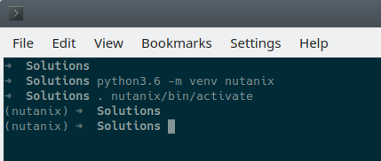
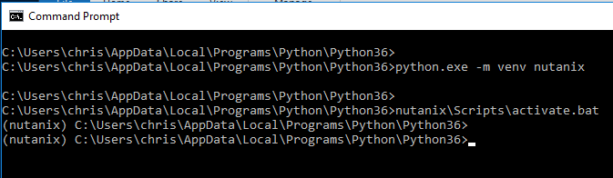
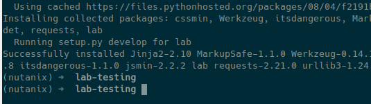
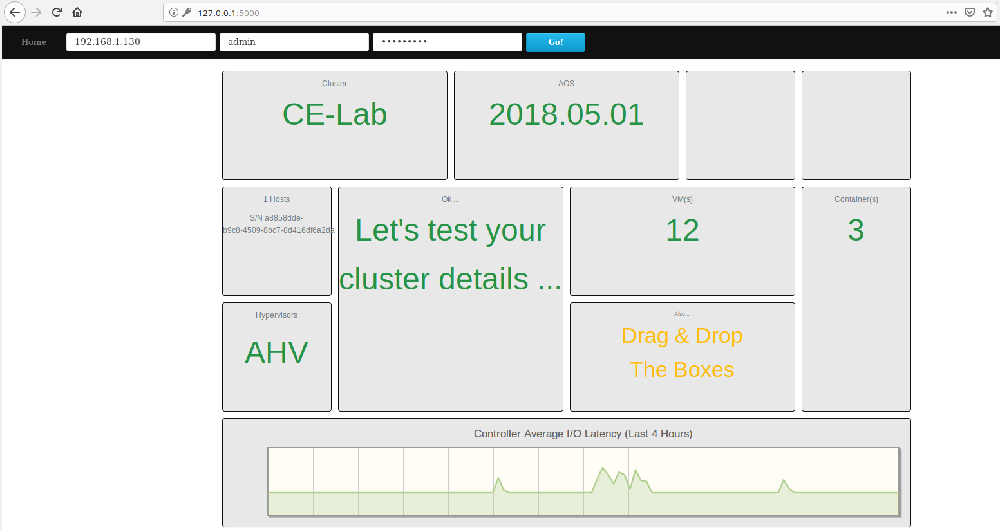

.. _apis:

--------------------
APIs: Python Example
--------------------

*The estimated time to complete this lab is 90 minutes.*

Overview
++++++++

**In this lab you will be introduced to different versions of the Nutanix APIs and utilize them to create a simple application using the** `Python Flask <http://flask.pocoo.org/>`_ **microframework. The application will provide a web front-end to display information to the user and a back-end model to communicate with Nutanix APIs. JavaScript will be used to create the interface between the front- and back-end parts of the application.**

Lab Setup
+++++++++

This lab requires a Python environment provisioned as part of either the :ref:`windows_tools_vm` **or** :ref:`linux_tools_vm`. You can choose which environment with which you are most comfortable.

If you have not yet deployed **either** of these VMs, see the linked steps before proceeding with the lab.

Project Location
................

You can store your project files anywhere you like.  To keep things consistent, we will use a folder named `python-lab`.  This folder will be referred to as the **project folder** throughout this lab.

Create a folder named `python-lab`, making sure you have write permissions to that folder.  If you are using the command line, some examples for creating the folder are as follows:

.. figure:: images/linux_logo_32x32.png
.. figure:: images/osx_logo_32x32.png

.. code-block:: bash

  cd ~
  mkdir python-lab
  cd python-lab

.. figure:: images/windows_logo_32x32.png

.. code-block:: bash

  cd %HOMEPATH%
  mkdir python-lab
  cd python-lab

Please ensure you have a command prompt open and have changed to the above directory before continuing.

Virtual Environments
....................

It is recommended that your Python development is done inside a Python virtual environment.  Developing in a virtual environment can help replicate and test things like Python setup scripts and ensure all dependencies are met before running a Python script or application.

Even though virtual environments (venv) are now included with Python 3, we'll use the following command to make sure they work.  Please run these commands from the directory your project will be stored in.

.. figure:: images/linux_logo_32x32.png
.. figure:: images/osx_logo_32x32.png

.. code-block:: bash

  python3.6 -m venv nutanix
  . nutanix/bin/activate

.. figure:: images/windows_logo_32x32.png

.. code-block:: bash

  python.exe -m venv nutanix
  nutanix\Scripts\activate.bat

.. note::

  **Windows:** As at January 2019, a **default** installation of Python 3.6 will be installed in the following folder: ``C:\Users\<username>\AppData\Local\Programs\Python\Python36``

Running these commands to setup and activate a new virtual environment will look similar to the following screenshot.

.. note::

  Note the `(nutanix)` designation that indicates we are now developing inside the new virtual environment.

If you need to leave the virtual environment, use the following command:

.. figure:: images/linux_logo_32x32.png
.. figure:: images/osx_logo_32x32.png

.. code-block:: bash

  deactivate

.. figure:: images/windows_logo_32x32.png

.. code-block:: bash

  nutanix\Scripts\deactivate.bat

.. note::

  Even though the commands above run .bat files, PowerShell .ps1 scripts are included, too.
  If you prefer to use PowerShell, replace `activate.bat` with `Activate.ps1`.
  To deactivate, simply enter `deactivate`.  There is no `Deactivate.ps1` as a script is created in memory for this purpose.

If you wish to delete the virtual environment at any stage, simply delete the `nutanix` virtual environment directory and all its contents.

.. note::

  For more information on virtual environments, please see the official Python virtual environment `documentation <https://docs.python.org/3/tutorial/venv.html>`_.

App Dependencies
................

Our application will require additional Python modules beyond those that are included in the `Python Standard Library <https://docs.python.org/3.6/library/>`_.

The easiest way to ensure these are available is by using a Python Setup Script.

In our case, the setup script is quite basic and simply installs any dependencies we don't already have available.

Firstly, make sure you have created and activated a virtual environment, as outlined above.
For this lab, your virtual environment should be called `nutanix`.

Create a script in the project folder named `setup.py`.
This setup script will handle the installation of dependencies required for this Python Flask application:

.. code-block:: python

  from setuptools import find_packages, setup

  setup(
          name='lab',
          version='1.0.0',
          packages=find_packages(),
          include_package_data=True,
          zip_safe=False,
          install_requires=[
              'flask',
              'flask_assets',
              'jsmin',
              'cssmin',
              'requests',
              'wtforms',
              'flask-wtf'
          ],
  )

The final file to create at this stage will allow us to make the app `installable`.
This file is called `MANIFEST.in` and describes the other files that are to be included during installation.
We haven't created some of these files, yet, but that's OK for now.

Create a file in the project folder named `MANIFEST.in` and add the following contents:

.. code-block:: bash

  graft lab/static
  graft lab/templates
  global-exclude *.pyc

Now, to ensure our dependencies are available, let's install our app for the first time.  This process makes use of both *setup.py* and *MANIFEST.in*.

.. note::

  The trailing period (`.`) is required.

.. figure:: images/linux_logo_32x32.png
.. figure:: images/osx_logo_32x32.png

.. code-block:: bash

  pip3 install -e .

.. figure:: images/windows_logo_32x32.png

.. code-block:: bash

  <python_install_folder>\Scripts\pip3.6.exe install -e .

If all dependencies have been found and installed correctly, the end of the output will look something like this.

.. note::

  Note that if you are installing packages you don't have, the messages regarding installing from cache may be slightly different.

Now our environment is setup to run our Python Flask application using Nutanix REST APIs.

Nutanix API Intro
+++++++++++++++++

Before we start creating our app, let's take a look at how Nutanix describes the APIs we'll use today.

**Those familiar with the Nutanix APIs may wish to skip directly to** `App Structure`_.

The Nutanix REST APIs allow you to create scripts that run system administration commands against the Nutanix cluster.
The API enables the use of HTTP requests to get information about the cluster as well as make changes to the configuration.
Output from the API calls are returned in JSON format.

The v2 API is an update of the v1 API. Users of the v1 API are encouraged to migrate to v2.

Authentication
..............

Authentication against the Nutanix REST APIs is done using HTTP Basic Authentication.
Requests on HTTP port 80 are automatically redirected to HTTPS port 443.
This requires that a valid cluster or configured directory service credential is passed as part of the API request.

For the purposes of this lab, we will assume you have access to at least a Nutanix cluster username with a minimum of READ access.
Note that a Cluster Admin account is not required to read information via Nutanix API request.

For those attendees or readers following this lab in a presenter-led environment, please use the cluster IP address and credentials given to you by your presenter.

Prism Element "vs" Prism Central
................................

Prism Element APIs are cluster-specific i.e. designed to manage and manipulate entities on the cluster Prism is running on.

Prism Central APIs include a larger set of APIs designed to manipulate entities that aren't necessarily specific to a single cluster.

API Versions
............

As at January 2019, there are four publicly available Nutanix APIs.  Note that while Nutanix API v0.8 is available via the REST API Explorer in Nutanix Prism, it is strongly recommended to use v2.0 APIs instead.  v0.8 is mentioned here for completeness reasons only.

The API versions available today are as follows.

- v1
- v2.0
- v3

.. note::

  In the sample commands below you'll see use of the `--insecure` cURL parameter.  This is used to get around SSL/TLS verification issues when using self-signed certificates.  Please consider the potential pitfalls and security implications of bypassing certificate verification before using `--insecure` in a production environment.  The same precautions apply when providing a username and password on the command-line.  This should be avoided when possible, since this method shows both the username and password in clear text.

.. note::

  When running the cURL sample commands on Windows 10, single-quote characters (`'`) may need to be replaced with double-quote characters (`"`).

API v0.8
~~~~~~~~

*Status: Super-ceded by API v2*

This set of APIs was available when API v1 didn’t yet have the capability to carry out some VM management operations, e.g. VM power state.

Using a combination of v0.8 and v1 APIs, nearly all information and functions available in Prism could be completed via API requests.

Here's an example of an API v0.8 request to list the VMs running on a cluster.

.. code-block:: html

  https://<cluster_virtual_ip>:9440/api/nutanix/v0.8/vms

Alternatively, this HTTPS API request can be carried out using the `curl` command:

.. code-block:: bash

  curl -X GET \
    'https://<cluster_virtual_ip>:9440/api/nutanix/v0.8/vms' \
    -H 'Accept: application/json' \
    -H 'Content-Type: application/json' \
    --insecure \
    --basic --user <cluster_username>:<cluster_password>

API v1
~~~~~~

*Status: Available*

This set of APIs, chronologically, was released before the v0.8 APIs. They were used, for example, to manipulate and view VMs, storage containers, storage pools etc. For some time, the v1 and v0.8 APIs were the only way we, as developers, had to interact with Nutanix clusters. Some of the API endpoints could only be used with the AHV hypervisor and some could be used across multiple hypervisors e.g. AHV and ESXi.

Here’s a simple example of a v1 API request to list all storage containers on a cluster:

.. code-block:: html

  https://<cluster_virtual_ip>:9440/api/nutanix/v1/containers

Alternatively, this HTTPS API request can be carried out using the `curl` command:

.. code-block:: bash

  curl -X GET \
    'https://<cluster_virtual_ip>:9440/api/nutanix/v1/containers?=' \
    -H 'Accept: application/json' \
    -H 'Content-Type: application/json' \
    --insecure \
    --basic --user <cluster_username>:<cluster_password>

One of the reasons to use API v1 today is to collect entity performance information.  For example, the application we are building in this lab contains API v1 requests to collect storage performance.  An upcoming Nutanix Developer blog article will discuss the API v1 performance metrics and how to use them.

API v2
~~~~~~

*Status: Available*

The v0.8 and v1 APIs worked really well. In fact, they were (and still are, in some respects) how the Prism UI gathers data from the cluster. Another over-simplification would be to say that the v2 APIs are where the v0.8 and v1 APIs came together. Many of the entities and endpoints available in v0.8 and v1 were made available in v2, along with a huge amount of backend cleanup, endpoint renaming and generally making the APIs better. The v2 APIs are also the first officially GA API made available by Nutanix.

If you have some exposure to the previous v0.8 and v1 APIs, moving to the v2 APIs will highlight a number of differences. For example “containers” got renamed to “storage_containers” and “storagePools” got renamed to “storage_pools”. The difference? A consistent naming convention in the form of `snake-case <https://en.wikipedia.org/wiki/Snake_case>`_ across all entities.

Here’s a basic example of a v2 API request to list all **storage_containers** on a cluster:

.. code-block:: html

  https://<cluster_virtual_ip>:9440/api/nutanix/v2.0/storage_containers

Alternatively, this HTTPS API request can be carried out using the `curl` command:

.. code-block:: bash

  curl -X GET \
    https://<cluster_virtual_ip>:9440/api/nutanix/v2.0/storage_containers \
    -H 'Accept: application/json' \
    -H 'Content-Type: application/json' \
    --insecure \
    --basic --user <cluster_username>:<cluster_password>

Quick Summary
~~~~~~~~~~~~~

Before moving forward, note that all the APIs above return a JSON response that is easily consumable by many programming or scripting languages.

Also, all the requests above are basic HTTP GET requests and do not require a payload (POST body).

API v3
~~~~~~

*Status: Available*

The v3 APIs, which were released in April 2018, are a departure from the previous API design.

We had standard GET requests to get data from a cluster and standard POST methods to make changes - the v3 APIs are a bit different. All the previous APIs still required the developer to tell the system what to do and how to do it. The v3 APIs, on the other hand, are the first APIs built around an Intentful paradigm, that is, `move the programming from the user to the machine`. Instead of writing a ton of code to get something done, we tell the system what the desired state is and the system will “figure out” the best way to get there. This will sound somewhat familiar to those using configuration management frameworks like Salt, Puppet, Chef, Ansible, PowerShell DSC etc.

How this all happens is somewhat beyond the scope of this particular lab but look at the request below. It’s still getting similar information to the previous requests but with a couple of key differences.

1. It is an HTTP POST request, not GET.
2. A JSON payload (POST body) is required so that the cluster knows what type of entity to return. In this example, we’re talking about VMs.
3. We’re telling the system what we want to do with the data. In this case, we want to list all VMs.
4. While this request can be run without issue against Prism Element, it can also be run against Prism Central. More on that later.

.. code-block:: html

  https://<prism_central_or_cluster_virtual_ip>:9440/api/nutanix/v3/vms/list

And the post body:

.. code-block:: JSON

  {"kind":"vm"}

Alternatively, this HTTPS API request can be carried out using the `curl` command:

.. code-block:: bash

  curl -X POST \
    https://<prism_central_virtual_ip>:9440/api/nutanix/v3/vms/list \
    -H 'Accept: application/json' \
    -H 'Content-Type: application/json' \
    -d '{"kind":"vm"}' \
    --insecure \
    --basic --user <cluster_username>:<cluster_password>

cURL Command Analysis
.....................

As an extra step, let's take the v3 API request above and look at what each part of the command is doing.  If you are familiar with using cURL to make API requests, please feel free to skip this section.

- `curl -X POST \` - Run cURL and specify that we will be making an HTTP POST request (as opposed to HTTP GET).
- `https://<prism_central_virtual_ip>:9440/api/nutanix/v3/vms/list \` - Specify the complete URL to send the request to.
- `-H 'Accept: application/json' \` - Specify the content types the client is able to understand.
- `-H 'Content-Type: application/json' \` - Tell the server what type of data is actually sent.
- `-d '{"kind":"vm"}' \` - For our POST request, specify the request **body** i.e. the parameters to send along with the request.
- `--insecure \` - Tell the cURL command to ignore SSL certificate verification errors (please see the note above re what this means).
- `--basic` - Tell the cURL command that we will authenticate using **Basic Authentication**.
- `--user <cluster_username>:<cluster_password>` - Specify the username and password to use during basic authentication.

API Version Use Cases
.....................

With what we know about the various API versions now, let's take a look at why you might use each API.

- **v1**: Legacy application support and cluster-wide performance metrics.
- **v2**: Migration away from legacy APIs, combination of older v0.8 and v1 APIs into single GA API, <em>cluster-specific</em> tasks e.g. storage container information & management.
- **v3 on Prism Element**: Latest supported API aimed at managing <em>cluster-specific</em> entities such as VMs.
- **v3 on Prism Central**: Latest supported API aimed at managing <em>environment-wide</em> configuration and entities.  Unlike API v3 on Prism Element, this includes a vast array of entities such as Nutanix Calm Blueprints, RBAC, Applications, Nutanix Flow Network Security Rules.

App Structure
+++++++++++++

Now we have a good understanding of the history and progression of the Nutanix REST APIs, lets get to using them inside of our Python Flask application.

Key Directories
...............

The key directories of our app are as follows.

- A folder called `lab`.  This folder contains our project's code and all associated files.
- `nutanix/`, the folder containing our virtual environment files.

Create the `/lab` directory now.

.. code-block:: bash

  mkdir lab

we'll create these files as we go through the lab, but here is some info of what they do.

- `lab/__init__.py`, the application's "main" entry point.
- `lab/static/`, the folder containing our JavaScript, CSS and JSON files that describe our main view's layout.
- `lab/static/js/lib/` and `lab/static/css/lib/`, collections of third-party JavaScripts and CSS to support our app.
- `lab/templates/`, our HTML layouts.
- `lab/util/apiclient/__init__.py`, our custom Python class that describes what an API request looks like and the functions associated with it.
- `lab/ajax.py`, the Python class that carries out AJAX requests called via JavaScript.
- `lab/forms.py`, the Python script that describes the user input form responsible for collecting credentials and cluster IP address.
- `config.py`, the Python script that contains configuration information.  Note that this file is **not** in the `lab` folder!
- `lab/index.py`, the Python blueprint responsible for handling the `/` route (URL).

In addition to the actual project files, most of which don't exist yet, the Git `.gitignore` file for this application is as follows.
This specific `.gitignore` file is often used with Python projects.
For our app, the `instance/` line has been added.
If you are using Git to manage your project's source, this `.gitignore` is a good one to use.

If you are going to store your application in Git or GitHub (recommended), create a file named `.gitignore` and add the following contents:

.. code-block:: bash

  nutanix/

  *.pyc
  __pycache__/

  instance/

  .pytest_cache/
  .coverage
  htmlcov/

  dist/
  build/
  *.egg-info/

The ApiClient class
...................

The first file we'll create is one of the most supporting files in the app.

This file is the **ApiClient** class and describes what an API request looks like as well as the functions associated with it.

Create the `lab/util/apiclient/` folders.

.. figure:: images/linux_logo_32x32.png
.. figure:: images/osx_logo_32x32.png

.. code-block:: bash

  mkdir -p lab/util/apiclient

  (nutanix) [root@centos python-lab]# mkdir -p lab/util/apiclient

Create the file `lab/util/apiclient/__init__.py`.

.. figure:: images/linux_logo_32x32.png
.. figure:: images/osx_logo_32x32.png

.. code-block:: bash

  vi lab/util/apiclient/__init__.py

  (nutanix) [root@centos python-lab]# vi lab/util/apiclient/__init__.py

The `__init__.py` file is a reserved filename that Python looks for when instantiating a class.

The contents of `__init.py__` should be as follows:

.. code-block:: python

  #!/usr/bin/env python3.6

  import sys
  import requests
  from requests.auth import HTTPBasicAuth
  import json

  class ApiClient():

      def __init__(self, method, cluster_ip, request, body, username, password, version='v3',root_path='api/nutanix'):
          self.method = method
          self.cluster_ip = cluster_ip
          self.username = username
          self.password = password
          self.base_url = f"https://{self.cluster_ip}:9440/{root_path}/{version}"
          self.entity_type = request
          self.request_url = f"{self.base_url}/{request}"
          self.body = body

      def get_info(self, show_info=False):

          if show_info == True:
              print(f"Requesting '{self.entity_type}' ...")
          headers = {'Content-Type': 'application/json; charset=utf-8'}
          try:
              if(self.method == 'post'):
                  r = requests.post(self.request_url, data=self.body, verify=False, headers=headers, auth=HTTPBasicAuth(self.username, self.password), timeout=60)
              else:
                  r = requests.get(self.request_url, verify=False, headers=headers, auth=HTTPBasicAuth(self.username, self.password), timeout=60)
          except requests.ConnectTimeout:
              print(f'Connection timed out while connecting to {self.cluster_ip}. Please check your connection, then try again.')
              sys.exit()
          except requests.ConnectionError:
              print(f'An error occurred while connecting to {self.cluster_ip}. Please check your connection, then try again.')
              sys.exit()
          except requests.HTTPError:
              print(f'An HTTP error occurred while connecting to {self.cluster_ip}. Please check your connection, then try again.')
              sys.exit()

          if r.status_code >= 500:
              print(f'An HTTP server error has occurred ({r.status_code}, {r.text})')
          else:
              if r.status_code == 401:
                  print(f'An authentication error occurred while connecting to {self.cluster_ip}. Please check your credentials, then try again.')
                  sys.exit()
              #if r.status_code > 401:
                  #print(json.loads(r.text)['message_list'][0]['message'])
                  #sys.exit()
              # else:
                  # print('Connected and authenticated successfully.')

          return(r.json())

A few things to note about this class:

- The `__init__` function runs when the class is instantiated and describes **how** it should be instantiated.
- In our ApiClient class, we are setting some properties of the class, such as the IP address of our cluster, the cluster and password (etc).
- The `get_info` function is called on-demand after the class is instantiated and carries out the actual API request.
- The `try` section of the `get_info` function attempts to complete the API request and get an HTTP response from the Nutanix API.
- The remaining `except` sections specify various exceptions that can be caught and dealt with accordingly.  For example, looking for `r.status_code >= 500` will catch any HTTP 500 errors.  This type of catch-all is bad practice in production environments but suits our basic demo requirements well enough.
- If no exceptions are caught, the JSON response from the API request is returned via `return(r.json())`.

With the basic application structure and main supporting class created, we can move forward with creating the other parts of our app.

Initialization
++++++++++++++

For this section we'll build the app based on the structure seen earlier.

Configuration Options
.....................

`config.py` is where our app stores app-specific configuration.
For this basic application we are only storing a single static configuration item - the `SECRET_KEY` required for CSRF protection.
For more information on CSRF_, please see the CSRF_ Wikipedia article.

CSRF protection isn't strictly required for demo or isolated applications, but is a good habit to get into when developing web applications.

.. _CSRF: https://en.wikipedia.org/wiki/Cross-site_request_forgery

Create `config.py`.

Please note that `config.py` should **not** be in the `lab/` folder.

.. figure:: images/linux_logo_32x32.png
.. figure:: images/osx_logo_32x32.png

.. code-block:: bash

  vi config.py

  (nutanix) [root@centos python-lab]# vi config.py

Add the following content to `config.py`:

.. code-block:: python

  import os

  class Config(object):
      SECRET_KEY = os.environ.get('SECRET_KEY') or 'some strong secret string'

We will import this key later to ensure our app is protected against CSRF.

Initialization Script
.....................

`lab/__init__.py` is our application's main initialisation script.  This file contains the application **factory** and instructs Python to treat our `lab` folder as a package.  In our app, configuration and setup, for example, will be carried out inside the factory function and the app returned afterwards.  For a more detailed explanation, please see the official factory tutorial_.

.. _tutorial: http://flask.pocoo.org/docs/1.0/tutorial/factory/

Create a file named `__init__.py` in the `lab/` folder.

.. figure:: images/linux_logo_32x32.png
.. figure:: images/osx_logo_32x32.png

..  code-block:: bash

  vi lab/__init__.py

  (nutanix) [root@centos python-lab]# vi lab/__init__.py

For our application, the initial contents of `__init__.py` should be as follows:

.. code-block:: python

  import os

  from flask import Flask
  from flask_assets import Environment, Bundle

  from .util import apiclient
  from config import Config

  def create_app(test_config=None):
      # create and configure the app
      app = Flask(__name__, instance_relative_config=True)

      assets = Environment(app)

      app.config.from_object(Config)

      if test_config is None:
          # load the instance config, if it exists, when not testing
          app.config.from_pyfile('config.py', silent=True)
      else:
          # load the test config if passed in
          app.config.from_mapping(test_config)

      # ensure the instance folder exists
      try:
          os.makedirs(app.instance_path)
      except OSError:
          pass

      return app

Key lines to look for in `__init__.py`:

- `from flask import Flask` makes the Flask web framework available to our application.
- `from flask_assets import Environment, Bundle` enables us to store configuration and bring together our static files as **bundles**.
- `from .util import apiclient` and `from config import Config` imports our ApiClient package and grabs our configuration from `config.py`.
- `os.makedirs(app.instance_path)` attempts to create our instance path that can be used to store local data, e.g. files that won't be committed to source control.  We aren't explicitly using this folder in our app but it is a useful to know about.

At this point our application will actually "work".  It won't do anything particularly useful, although now is a good time to see how to run a Python Flask application.

Application first run
.....................

Since we are developing a simple demo application, we only have two requirements to run our app.  Run these commands in the application's main folder i.e. **not** in the `lab/` folder.

Tell Python Flask where to find our application.

.. figure:: images/linux_logo_32x32.png
.. figure:: images/osx_logo_32x32.png

.. code-block:: bash

  export FLASK_APP=lab

  (nutanix) [root@centos python-lab]# export FLASK_APP=lab

.. figure:: images/windows_logo_32x32.png

.. code-block:: bash

  set FLASK_APP=lab

Tell Python Flask to run our app in development mode:

.. figure:: images/linux_logo_32x32.png
.. figure:: images/osx_logo_32x32.png

.. code-block:: bash

  export FLASK_ENV=development

  (nutanix) [root@centos python-lab]# export FLASK_ENV=development

.. figure:: images/windows_logo_32x32.png

.. code-block:: bash

  set FLASK_ENV=development

Run the application:

.. figure:: images/linux_logo_32x32.png
.. figure:: images/osx_logo_32x32.png
.. figure:: images/windows_logo_32x32.png

.. code-block:: bash

  flask run --host 0.0.0.0

At this point, Python Flask tells us exactly what to do in order to test the beginnings of our application:

.. code-block:: bash

  * Running on http://0.0.0.0:5000/ (Press CTRL+C to quit)

Browse to \http://<*Initials*-Linux-ToolsVM IP>:5000 on your local machine, or open a browser on your Windows-ToolsVM and point to \http://<*Initials*-Windows-ToolsVM IP>:5000.

If everything is working, you'll get an HTTP 404 (Not Found) error.

At this point, that is completely expected but indicates that your environment is setup correctly and Flask is listening for HTTP requests on port 5000.

Check the output in your console/terminal and you'll also see the 404 error reflected there, as expected:

This is a good test as it verifies everything is setup and working.  It also verifies that the dependencies are installed, along with Python Flask being ready to serve your application.

Stop the application (Press CTRL+C to quit)

Now let's start building our application by adding the application's supporting files.

Supporting Files
++++++++++++++++

In this part of the lab we're going to add the supporting JavaScript and CSS files.  These files are critical to the layout and functionality of the app.

Checking directory structure
............................

Create the following directories and files:

- **lab/static/css/lib**
- **lab/static/css/fonts**
- **lab/static/js/lib**
- **lab/static/layouts**

.. figure:: images/linux_logo_32x32.png
.. figure:: images/osx_logo_32x32.png

.. code-block:: bash

  mkdir -p lab/static/css/lib

  mkdir -p lab/static/css/fonts

  mkdir -p lab/static/js/lib

  mkdir -p lab/static/layouts

  (nutanix) [root@centos python-lab]# mkdir -p lab/static/css/lib
  (nutanix) [root@centos python-lab]# mkdir -p lab/static/css/fonts
  (nutanix) [root@centos python-lab]# mkdir -p lab/static/js/lib
  (nutanix) [root@centos python-lab]# mkdir -p lab/static/layouts

Adding Third Party Files
........................

From the URLs below, grab the relevant file, make sure the name is correct and extract it into the appropriate directory.

- CSS_ - extract to **lab/static/css/lib/**
- FONTS_ - extract to **lab/static/css/fonts/**
- Javascript_ - extract to **lab/static/js/lib/**

.. figure:: images/linux_logo_32x32.png
.. figure:: images/osx_logo_32x32.png

.. code-block:: bash

  curl -L https://s3.amazonaws.com/get-ahv-images/css-lib.zip -o css-lib.zip

  curl -L https://s3.amazonaws.com/get-ahv-images/fonts.zip -o fonts.zip

  curl -L https://s3.amazonaws.com/get-ahv-images/js-lib.zip -o js-lib.zip

.. note::

  When extracting the ZIP files, ensure they are extracted **directly** to the directories above and not into subdirectories.

.. figure:: images/linux_logo_32x32.png
.. figure:: images/osx_logo_32x32.png

.. code-block:: bash

  unzip -d lab/static/css/lib/ css-lib.zip

  unzip -d lab/static/css/fonts/ fonts.zip

  unzip -d lab/static/js/lib/ js-lib.zip

.. _CSS: https://s3.amazonaws.com/get-ahv-images/css-lib.zip
.. _FONTS: https://s3.amazonaws.com/get-ahv-images/fonts.zip
.. _Javascript: https://s3.amazonaws.com/get-ahv-images/js-lib.zip

Adding Custom Files
...................

From the URLs below, grab the relevant file, make sure the name is correct and copy it into the appropriate directory.

- ntnx.css_ - copy to **lab/static/css**
- ntnx.js_ - copy to **lab/static/js**
- dashboard.json_ - copy to **lab/static/layouts**

.. figure:: images/linux_logo_32x32.png
.. figure:: images/osx_logo_32x32.png

.. code-block:: bash

  curl -L https://s3.amazonaws.com/get-ahv-images/ntnx.css -o lab/static/css/ntnx.css

  curl -L https://s3.amazonaws.com/get-ahv-images/ntnx.js -o lab/static/js/ntnx.js

  curl -L https://s3.amazonaws.com/get-ahv-images/dashboard.json -o lab/static/layouts/dashboard.json

  (nutanix) [root@centos python-lab]# curl -L https://s3.amazonaws.com/get-ahv-images/ntnx.css -o lab/static/css/ntnx.css
  (nutanix) [root@centos python-lab]# curl -L https://s3.amazonaws.com/get-ahv-images/ntnx.js -o lab/static/js/ntnx.js
  (nutanix) [root@centos python-lab]# curl -L https://s3.amazonaws.com/get-ahv-images/dashboard.json -o lab/static/layouts/dashboard.json

.. _ntnx.css: https://s3.amazonaws.com/get-ahv-images/ntnx.css
.. _ntnx.js: https://s3.amazonaws.com/get-ahv-images/ntnx.js
.. _dashboard.json: https://s3.amazonaws.com/get-ahv-images/dashboard.json

Referencing Supporting Files
............................

- Open `lab/__init__.py` and, under the line that reads `assets = Environment(app)`, add the following Python code.

.. note::

  Python has strict `indentation <https://docs.python.org/3.6/reference/lexical_analysis.html>`_ requirements.  For the code below, make sure the indentation begins at the same point as the `assets = Environment(app)` line.

.. code-block:: python

  home_css = Bundle(
          'css/lib/reset.css',
          'css/lib/built-in.css',
          'css/lib/jquery-ui-custom.css',
          'css/lib/jq.gridster.css',
          'css/lib/jq.jqplot.css',
          'css/ntnx.css'
  )
  home_js = Bundle(
          'js/lib/jquery-2.1.3.min.js',
          'js/lib/classie.min.js',
          'js/lib/ntnx-bootstrap.min.js',
          'js/lib/modernizr.custom.min.js',
          'js/lib/jquery.jqplot.min.js',
          'js/lib/jqplot.logAxisRenderer.js',
          'js/lib/jqplot.categoryAxisRenderer.js',
          'js/lib/jqplot.canvasAxisLabelRenderer.js',
          'js/lib/jqplot.canvasTextRenderer.js',
          'js/lib/jquery.gridster.min.js',
          'js/ntnx.js'
  )

  assets.register('home_css',home_css)
  assets.register('home_js',home_js)

This code block registers two 'bundles' that allow our app to correctly load and access the JavaScript and CSS files.  Firstly, the bundles are created as `home_css` and `home_js`, then registered as application assets using `assets.register`.

With this done, we can continue with working on our application.

Views, Blueprints and Templates
+++++++++++++++++++++++++++++++

For our application to function correctly we need a few more things.  Primarily:

- **Views**, the code that handles requests to specific URLs in your application.
- **Blueprints**, a logical grouping of related code and views.
- **Templates**, files that contain static data e.g. HTML for layout/display purposes as well as placeholders that will be replaced later with dynamic data.

Views
.....

Because we are writing a single-page application that is accessed via the root (`/`) URL, we have a view named `index` whose contents are in `lab/index.py`.  It will handle all requests to the root URL.

However, that view references other views that we haven't created, yet.  To prepare for the main application view, let's first create the 'forms' view.  It handles the creation of the form that accepts input from the user.

Create `lab/forms.py`:

.. figure:: images/linux_logo_32x32.png
.. figure:: images/osx_logo_32x32.png

.. code-block:: bash

  vi lab/forms.py

Add the following content:

.. code-block:: python

  from flask_wtf import FlaskForm
  from wtforms import StringField, PasswordField, BooleanField, SubmitField
  from wtforms.validators import DataRequired

  """
  The clusterForm class is used to identify the properties used when submitted cluster details
  """
  class clusterForm(FlaskForm):
      cvmAddress = StringField('cvmAddress', validators=[DataRequired()])
      username = StringField('username', validators=[DataRequired()])
      password = PasswordField('password', validators=[DataRequired()])
      submit = SubmitField('Go!', id="goButton")

The resources below are for learning more about forms management in Python Flask:

- wtforms_ (Forms management for Python Flask)
- Flask-WTF_ (Simple integration of Flask and WTForms, including CSRF, file upload, and reCAPTCHA.)

.. _wtforms: https://wtforms.readthedocs.io/en/stable/
.. _Flask-WTF: https://flask-wtf.readthedocs.io/en/stable/

With the forms view created, we look at the main view for our application.  Let's do that now.

Create `lab/index.py` and

.. figure:: images/linux_logo_32x32.png
.. figure:: images/osx_logo_32x32.png

.. code-block:: bash

  vi lab/index.py

Add the following content:

.. code-block:: python

  from lab.forms import clusterForm

  from flask import (
      Blueprint, flash, g, redirect, render_template, request, session, url_for
  )
  from werkzeug.security import check_password_hash, generate_password_hash

  bp = Blueprint('index', __name__, url_prefix='/')

  @bp.route('/')
  def index():
      # make sure we are using the form that's been generated in forms.py
      form = clusterForm()
      return render_template('index.html', form=form)

You'll notice that the first thing the `index` view does is reference the `forms` view we created a moment ago.

The view does a few things:

- Registers the '/' URL
- Creates an instance of our `form` view
- Renders the view based on the `index.html` template (which we will create shortly)

However, for this view to function correctly, we now need to make it available via the application initialisation script.

Open `lab/__init__.py`

Below the line that says `    pass`, add the following content, remembering to indent the code correctly:

.. code-block:: python

  from . import index
  app.register_blueprint(index.bp)

  from . import ajax
  app.register_blueprint(ajax.bp)

The `index` view (and `ajax` view, which we will create shortly) are now available to our app.

Quick question - what will happen if we now run our application?  Correct - we will be shown an error saying the `ajax` view can't be imported.  To fix that and prepare for template creation, let's create our `ajax` view now.

Create `lab/ajax.py`

.. figure:: images/linux_logo_32x32.png
.. figure:: images/osx_logo_32x32.png

.. code-block:: bash

  vi lab/ajax.py

Add the following content. (We'll go through what the view does in an upcoming section).

.. code-block:: python

  import os
  import json
  import base64
  import sys
  from datetime import datetime
  from datetime import timedelta
  import time

  from flask import (
      Blueprint, flash, g, redirect, render_template, request, session, url_for, jsonify
  )
  from werkzeug.security import check_password_hash, generate_password_hash

  from .util import apiclient

  bp = Blueprint('ajax', __name__, url_prefix='/ajax')

  """
  get the form POST data provided by the user
  """
  def get_form():
      global form_data
      global cvmAddress
      global username
      global password
      form_data = request.form
      cvmAddress = form_data['_cvmAddress']
      username = form_data['_username']
      password = form_data['_password']

  """
  load the default layout at app startup
  """
  @bp.route('/load-layout',methods=['POST'])
  def load_layout():
      site_root = os.path.realpath(os.path.dirname(__file__))
      layout_path = 'static/layouts'
      dashboard_file = 'dashboard.json'
      with open( f'{site_root}/{layout_path}/{dashboard_file}','r') as f:
          raw_json = json.loads(f.read())
          return base64.b64decode(raw_json['layout']).decode('utf-8')

  """
  get some high level cluster info
  """
  @bp.route('/cluster-info',methods=['POST'])
  def cluster_info():
      # get the request's POST data
      get_form()
      client = apiclient.ApiClient('post', cvmAddress,'clusters/list','{"kind":"cluster"}',username,password)
      results = client.get_info()
      return jsonify(results)

  """
  get the vm count
  """
  @bp.route('/vm-info',methods=['GET','POST'])
  def vm_info():
      # get the request's POST data
      get_form()
      client = apiclient.ApiClient('get', cvmAddress,'vms','',username,password,'v2.0')
      results = client.get_info()
      return jsonify(results)

  """
  get the cluster's physical info e.g. # of hosts, host serial numbers
  """
  @bp.route('/physical-info',methods=['POST'])
  def physical_info():
      # get the request's POST data
      get_form()
      client = apiclient.ApiClient('get', cvmAddress,'hosts','',username,password,'v2.0')
      results = client.get_info()
      return jsonify(results)

  """
  get the cluster's storage performance
  """
  @bp.route('/storage-performance',methods=['POST'])
  def storage_performance():
      # get the request's POST data
      get_form()

      # get the current time then substract 4 hours
      # this is used for the storage performance chart
      endTime = datetime.now()
      delta = timedelta(hours=-4)
      startTime = endTime + delta
      endTime = round(time.mktime(endTime.timetuple()) * 1000 * 1000)
      startTime = round(time.mktime(startTime.timetuple()) * 1000 * 1000)

      client = apiclient.ApiClient('get',cvmAddress,f'cluster/stats/?metrics=controller_avg_io_latency_usecs&startTimeInUsecs={startTime}&endTimeInUsecs={endTime}&intervalInSecs=30','',username,password,'v1','PrismGateway/services/rest')
      results = client.get_info()
      return jsonify(results)

  """
  get the container info e.g. # of containers
  """
  @bp.route('/container-info',methods=['POST'])
  def containers():
      # get the request's POST data
      get_form()
      client = apiclient.ApiClient('get',cvmAddress,f'storage_containers','',username,password,'v2.0')
      results = client.get_info()
      return jsonify(results)

Templates
.........

Create the `lab/templates` folder.

.. figure:: images/linux_logo_32x32.png
.. figure:: images/osx_logo_32x32.png

.. code-block:: bash

  mkdir -p lab/templates

Inside the `templates` folder we are going to create two templates.  These are as follows:

- `base`, the **master** template that our application's main view will be based on.
- `index`, the application's main view i.e. the one that we'll actually see.

Both templates are mostly HTML, with the exception of a few placeholders.
The placeholders are identified by being enclosed in `{{` and `}}` and will be replaced with dynamic data when the template is rendered.

Create `lab/templates/base.html`:

.. figure:: images/linux_logo_32x32.png
.. figure:: images/osx_logo_32x32.png

.. code-block:: bash

  vi lab/templates/base.html

Add the following content:

.. code-block:: html

  <!doctype html>
  <html lang="en">
      <head>
          <meta charset="utf-8">
          <meta http-equiv="X-UA-Compatible" content="IE=edge,chrome=1">
          <meta name="viewport" content="width=device-width, initial-scale=1">
          <title> - Lab</title>

          
              <link rel="stylesheet" href="{{ ASSET_URL }}">
          

      </head>
      <body>
          <nav class="navbar navbar-default navbar-fixed-top main-nav">
              

                  

                      <ul class="nav navbar-nav">
                          <li><a href="#">Home</a></li>
                          <!--<li><a href="#" class="saveLayout">Save Layout</a></li>
                          <li><a href="#" class="defaultLayout">Revert to Default Layout</a></li>-->
                      </ul>
                      <form method="post" class="navbar-form navbar-left">
                          

                              {{ form.hidden_tag() }}
                              {{ form.cvmAddress(class="form-control",placeholder="Cluster/CVM IP") }}
                              {{ form.username(class="form-control",placeholder="Cluster Username") }}
                              {{ form.password(class="form-control",placeholder="Cluster Password") }}
                              {{ form.submit(class="btn btn-primary") }}
                          

                      </form>
                  

              

          </nav>
          <section class="content">
              
                  
{{ message }}

              
              
          </section>

          

          
              
          

      </body>

  </html>

Create `lab/templates/index.html`:

.. figure:: images/linux_logo_32x32.png
.. figure:: images/osx_logo_32x32.png

.. code-block:: bash

  vi lab/templates/index.html

Add the following content:

.. code-block:: html

  
  
      Home
  

  

  

      

          

              

                  

                      

                          

                              <ul>
                                  <!-- The grid layout will end up here, once it is generated -->
                              </ul>
                          

                      

                  

              

          

      

  

  

We already know that the `base` template will be used as the **master** template for all others in our app.  In our specific application we only have a single 'visible' view - the `index`.

Most of the content above will look very familiar, but with the addition of this line in particular:

.. code-block:: html

  

We can now tell that the `index` template is rendered using the `base` template.

Now let's look a little deeper into the `ajax` view and see how it works.

The AJAX View
+++++++++++++

JavaScript function
...................

The `ajax` view is a key part of our application.  This function is in the `lab/static/js/ntnx.js` file.  When the user enters their cluster or CVM IP address, credentials and hits the 'Go!' button, JavaScript makes various calls to the Nutanix APIs.  These calls are handled via AJAX_ so the user's browser doesn't get refreshed every time.

.. _AJAX: https://en.wikipedia.org/wiki/Ajax_(programming)

As an example, let's first take a look at the JavaScript function that gets a count of VMs running on our cluster.

.. code-block:: JavaScript

  vmInfo: function( cvmAddress, username, password )
  {

      vmData = $.ajax({
          url: '/ajax/vm-info',
          type: 'POST',
          dataType: 'json',
          data: { _cvmAddress: cvmAddress, _username: username, _password: password },
      });

      vmData.success( function(data) {
          NtnxDashboard.resetCell( 'vmInfo' );
          $( '#vmInfo' ).addClass( 'info_big' ).append( '
VM(s)

' + data['metadata']['count'] + '

');
      });

      vmData.fail(function ( jqXHR, textStatus, errorThrown )
      {
          console.log('error getting vm info')
      });
  },

Here are the most important steps carried out by this function:

- `vmInfo: function( cvmAddress, username, password )` - the name of the function, accepting the cluster/CVM IP address & and credentials.
- `vmData = $.ajax({` - use jQuery_ to initiate an AJAX request.
- `url: '/ajax/vm-info',` - the URL of the AJAX call that will be made.
- The block beginning with `vmData.success( function(data) {` - the JavaScript that will run when the AJAX call is successful.
- The block beginning with `vmData.fail(function ( jqXHR, textStatus, errorThrown )` - displays a message in the browser console when any error is encountered.  Of course, this "catch-all" approach is something that should be avoided before deploying to or developing for a production environment, but provides information that can be used to diagnose an issue.

.. _jQuery: https://jquery.com/

The AJAX
........

Now that we are familiar with the simple JavaScript code that will make the AJAX call, let's look at the Python code that carries out the first part of the API request.

.. code-block:: python

  """
  get the vm count
  """
  @bp.route('/vm-info',methods=['GET','POST'])
  def vm_info():
      # get the request's POST data
      get_form()
      client = apiclient.ApiClient('get', cvmAddress,'vms','',username,password,'v2.0')
      results = client.get_info()
      return jsonify(results)

Here are the most important steps carried out by this function:

- `@bp.route('/vm-info',methods=['GET','POST'])` - Specify the URL that will respond to the AJAX call and allow both GET and POST methods.  During testing it can be useful to allow both methods, although production apps would only allow the methods that are explicitly required.
- `get_form()` - Get the user data available in the POST request.  This includes the CVM/Cluster IP address, username and password.
- `client = apiclient.ApiClient('get', cvmAddress,'vms','',username,password,'v2.0')` - Create an instance of our `ApiClient` class and set the properties we'll need to execute the API request.

.. note::

  You'll notice a few parameters being passed during instantiation of the ApiClient class.  As an optional step, open `lab/util/apiclient/__init__.py` and look at the other parameters that can be passed.  For example, you can specify the API endpoint we're interested and the API version.  These are useful options for using the same ApiClient class with different versions of the APIs.

- `results = client.get_info()` - Execute the actual API request.
- `return jsonify(results)` - Convert the API request results to JSON format and return the JSON back to the calling JavaScript, where it will be processed and displayed in our app.

The API request
...............

Because the Nutanix REST APIs are designed to be simple to use, it's very easy to understand what the request itself is doing.

In the **Intro** section of this lab, we looked at the various Nutanix API versions that are available to you.  In the example above, we are using Nutanix API v2.0 to get a count of VMs running on our cluster.  The JavaScript making the AJAX call and the Python executing the API request, are constructing the following GET request.

.. note::

  The request coming from the JavaScript to our Python view is an HTTP POST request.  The request to the API itself, in this example, is an HTTP GET request.

.. code-block:: html

  https://<cluster_virtual_ip>:9440/api/nutanix/v2.0/vms

If you were to change `<cluster_virtual_ip>` to your cluster IP address and browse to that URL, you would probably see an error saying `"An Authentication object was not found in the SecurityContext"`.  That's because we haven't specified the credentials that should be used for the request.

.. note::

  If you have an open browser tab where you are already logged in and authenticated with an active Nutanix Prism session, it is possible the request may succeed.

Now that we have our API request URL, we can add HTTP Basic Authentication in the form of a username and password, then simulate the entire request using cURL.  For this quick test we will assume the following:

- **Cluster virtual IP address** - *your HPOC Cluser IP*
- **Cluster username** - admin
- **Cluster password** - techX2019!

.. code-block:: bash

  curl -X GET \
    https://<*ClusterIP*>:9440/api/nutanix/v2.0/vms \
    -H 'Accept: application/json' \
    -H 'Content-Type: application/json' \
    --insecure \
    --basic --user admin:nutanix4u

Please be mindful of the `--insecure` parameter, as detailed in the lab intro.

Testing The App
+++++++++++++++

With our JavaScript, AJAX, CSS, views and templates now in place, it's a good time to run our application and see what happens.

If you don't currently have your virtual environment activated or if the application isn't running, these are the steps to do so.  Make sure you are in the application's directory before running these commands.

.. figure:: images/linux_logo_32x32.png
.. figure:: images/osx_logo_32x32.png

.. code-block:: bash

  . nutanix/bin/activate

  export FLASK_APP=lab

  export FLASK_ENV=development

  flask run --host 0.0.0.0

.. figure:: images/windows_logo_32x32.png

.. code-block:: bash

  set FLASK_APP=lab
  set FLASK_ENV=development
  nutanix\Scripts\activate.bat
  flask run --host 0.0.0.0

Browse to \http://<*Initials*-Linux-ToolsVM IP>:5000 on your local machine to view your application,  or open a browser on your Windows-ToolsVM and point to \http://<*Initials*-Windows-ToolsVM IP>:5000.

If everything is setup correctly, you will see a basic HTML form prompting for a **Cluster/CVM IP**, your **Cluster Username** and **Cluster Password**.

You'll also see a number of styled and labelled "containers", ready for our cluster info to be displayed.

Fill out the following fields:

- **Cluster/CVM IP**  - *Assigned HPOC Cluster IP*
- **Cluster Username**  - admin
- **Cluster Password**  - techX2019!

Click **Go!**

If everything has been created and all parts of the application wired up correctly, the application will carry out our API requests via AJAX, process the results and display it all nicely on our page.

A successful test run will look similar to the screenshot below, although your cluster details will be different.

Final Thoughts
++++++++++++++

With this app built from scratch, you should now have a solid idea of how a Python Flask web application can be built to integrate with the Nutanix APIs.

For further information on the Nutanix REST API versions and the data that is exposed by them, please see the `Nutanix Developer Portal <https://developer.nutanix.com>`_.  There will you find code samples, documentation and information on everything from the APIs we used today (v1 and v2.0) through to v3 APIs, the current "intentful" API implementation.

Thanks for attending this lab.

Takeaways
+++++++++

What are the key things you should know about **Nutanix APIs**?

- Nutanix REST APIs are aimed at anyone wanting to automate cluster or application operations.
- Custom applications can be integrated with Nutanix products using the APIs.
- The APIs are designed to be simple and easy to consume.
- Nearly all operations that can be carried out in Prism can be carried out via API.
- The Nutanix REST APIs are always evolving, with new features being added all the time.
- Customer and prospect API Labs are a great way to introduce others to the APIs.
- The API Labs can be run self-paced i.e. on the attendee’s own device or as an SE-led event.

Getting Connected
+++++++++++++++++

Have a question about **Nutanix APIs**? Please reach out to the resources below:

+------------------------------------------------------------------------------------+
|  Xi Epoch Product Contacts                                                         |
+================================+===================================================+
|  Slack Channel                 |  #rest-api, #developer-ecosystem                  |
+--------------------------------+---------------------------------------------------+
|  Product Manager               |  Tarak Parekh, tarak.parekh@nutanix.com           |
+--------------------------------+---------------------------------------------------+
|  Developer Marketing           |  Luke Kilpatrick, luke.kilpatrick@nutanix.com     |
+--------------------------------+---------------------------------------------------+
|  Developer Marketing           |  Chris Rasmussen, crasmussen@nutanix.com          |
+--------------------------------+---------------------------------------------------+
