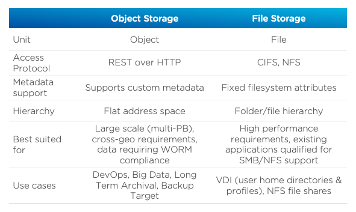
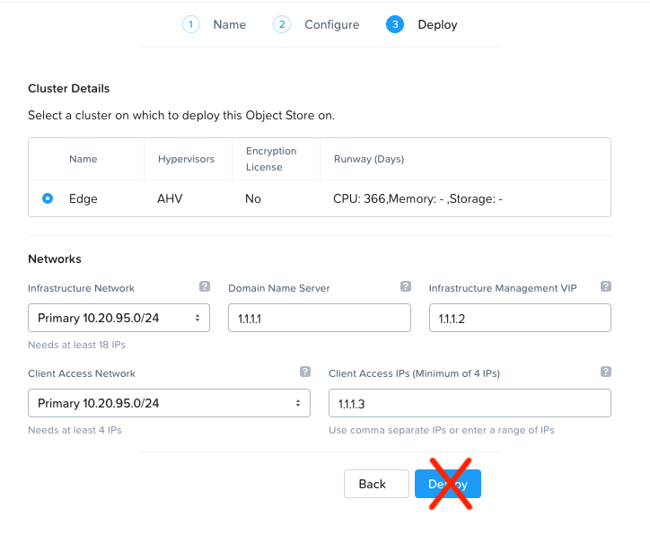

.. _buckets:

---------------
Buckets
---------------

*The estimated time to complete this lab is 60 minutes.*

.. raw:: html

  <iframe width="640" height="360" src="https://www.youtube.com/embed/2-AGtHhpFs8?rel=0&amp;showinfo=0" frameborder="0" allow="accelerometer; autoplay; encrypted-media; gyroscope; picture-in-picture" allowfullscreen></iframe>

Overview
++++++++

Data is growing faster than ever before, and much of the new data generated every second is unstructured. Video, backups, images, and e-mail archives are all examples of unstructured data that can cause issues at scale using traditional file and block storage solutions.

Unlike file or block storage, object storage is a data storage architecture designed for unstructured data at the petabyte scale. Object storage manages data as objects, where each object contains the data itself, a variable amount of metadata, and a globally unique identifier. There is no filesystem overhead as there is in block and file storage, so it can be easily scaled out at a global level.

Nutanix Buckets is an S3-compatible object storage solution that leverages the underlying Nutanix storage fabric which allows it to benefit from features such as encryption, compression, and erasure coding (EC-X).

Buckets allows users to store petabytes of unstructured data on the Nutanix platform, with support for features such as WORM (write once, read many) and object versioning that are required for regulatory compliance, and easy integration with 3rd party backup software and S3-compatible applications.

**What are the use cases for Nutanix Buckets?**

- DevOps
    - Single global namespace for multi-geography collaboration for teams spread around the world
    - S3 support
    - Time-to-first-byte of 10ms or less
- Long Term Data Retention
    - WORM compliance
    - Object versioning
    - Lifecycle policies
- Backup Target
    - Support for HYCU and Commvault at GA, with other vendors on the roadmap.
    - Ability to support multiple backup clients simultaneously.
    - Ability to handle really small and really large backup files simultaneously with a key-value store based metadata structure and multi-part upload capabilities.

**In this lab, you will walk through a Buckets object store deployment and learn how to create, access, and manage buckets using a popular file transfer application and programmatically via Python.**

Lab Setup
+++++++++

This lab requires applications provisioned as part of the :ref:`windows_tools_vm` **and** :ref:`linux_tools_vm`.

If you have not yet deployed **both** of these VMs, see the linked steps before proceeding with the lab.

As Buckets is not yet GA, the lab will leverage an existing Buckets Object Store deployment accessible from the following cluster: https://10.42.71.39:9440

**Google Chrome is recommended for this lab.**

Getting Familiar with Object Storage
++++++++++++++++++++++++++++++++++++

An object store is a repository for storing objects. Objects are stored in a flat hierarchy and made up of only 3 attributes - an unique key or identifier, the data itself, and an expandable amount of metadata.  An object store is a single global namespace on which buckets can be created. A bucket can be thought of as similar to a folder in a file storage environment. However, object storage and file storage are very different. Here are some ways object storage and file storage differ.

Getting Familiar with the Nutanix Buckets Environment
+++++++++++++++++++++++++++++++++++++++++++++++++++++

This exercise will familiarize you with the Nutanix Buckets environment. You will learn:

- What constitutes the Microservices Platform (MSP) and the services that make up Nutanix Buckets.
- How to deploy an Object Store

.. note::

  At the time of development, Buckets is still pre-GA and has been deployed to a dedicated Nutanix cluster running non-GA AOS/Prism Central. This environment will be shared by all attendees completing this lab. Please be respectful.

View the Object Storage Services
................................

#. Login into Prism Central hosting Buckets (https://10.42.71.39:9440) using the following credentials:

   - **Username** - admin
   - **Password** - Nutanix.123

#. Select :fa:`bars` **> Services > Buckets**.

   View the existing Object Stores. You will be using the techsummit2019 Object Store throughout this lab.

#. Select :fa:`bars` **> Virtual Infrastructure > VMs**.

   For a small deployment, you will see 4 VMs, each preceded with the name of the object store.

   For example, if the name of the object store is **object-store-demo**, there will be a VM with the name **object-store-demo-envoy-1**.

   We are using a small deployment, the deployed VMs are listed in the following table. Take note of the vCPU and Memory assigned to each.

   +----------------+-------------------------------+---------------+-------------+
   |  VM            |  Purpose                      |  vCPU / Cores |  Memory     |
   +================+===============================+===============+=============+
   |  default-0     |  Kubernetes Node              |  4 / 2        |  8 GiB      |
   +----------------+-------------------------------+---------------+-------------+
   |  default-1     |  Kubernetes Node              |  4 / 2        |  8 GiB      |
   +----------------+-------------------------------+---------------+-------------+
   |  default-2     |  Kubernetes Node              |  4 / 2        |  8 GiB      |
   +----------------+-------------------------------+---------------+-------------+
   |  envoy-1       |  Load Balancer / Endpoint     |  2 / 2        |  4 GiB      |
   +----------------+-------------------------------+---------------+-------------+

   All of these VMs are deployed by the Microservices Platform (MSP), the Kubernetes-based platform on which multiple future Nutanix services will be run. The service that controls the MSP runs on Prism Central.

   The **default** VMs run the Kubernetes cluster. The Kubernetes cluster consists of one or more master nodes, which provides the control plane for the Kubernetes cluster, as well as worker nodes. Kubernetes is running in multi-master mode, which allows for any node to become the master if needed.

   These nodes run etcd, which is a Kubernetes-level distributed key-value store for storing and replicating the Kubernetes-cluster level metadata. The nodes also run the object store components. This includes:

   - S3 adapter (minio-based) - this translates the S3 language into our internal language.
   - Object controller - this handles all the I/O. Think of it as like Stargate in AOS.
   - Metadata service - this handles the metadata for the object storage cluster. Think of it as like Medusa/Cassandra in AOS.
   - Atlas service - this handles garbage collection. Think of it as like Curator in AOS.
   - UI gateway - this is the endpoint for all UI requests, handles bucket management, stats display, user management interface, etc.
   - Zookeeper - this manages the configuration for the object storage cluster.
   - IAM service - handles user authentication for accessing buckets.

   The envoy VM is the load balancer and endpoint. The IP address of this VM is the IP used by clients to access the object store. It is the first point of entry for an object request (for example, an S3 GET or PUT). It then forwards this request to one of the worker VMs (specifically, the S3 adapter service running as part of the object-controller pod).

Walk Through the Object Store Deployment
........................................

In this exercise you will walk through the steps of creating an Object Store. **In the Tech Summit Buckets environment, you will not be able to actually deploy the Object Store, but you will be able to see the workflow and how simple it is for users to deploy an Object Store.**

.. note::

  In many use cases only a single object store is required. If global namespace isolation is required, for example a Service Provider is providing object storage to multiple customers from the same infrastructure, then multiple object stores can be created.

#. In :fa:`bars` **> Services > Buckets**, click **Create Object Store**.

   .. figure:: images/buckets_01.png

#. Fill out the following fields:

   - **Object Store Name** - *initials*-oss
   - **Domain**  - ntnxlab.com

   .. figure:: images/buckets_02.png

#. Click **Next**.

   Next you will be able to configure the capacity of your object store.

   The chosen option determines how many nodes will be deployed and the size of each.

   .. note::

     Note that although a storage capacity is defined here, it is not a hard limit, and the customer is limited only by their license and the storage capacity of the cluster.

   Select the different options (Small, Medium, Large) and notice how the Resource numbers change. These are the resources that will be applied across the K8s worker VMs. For example, specifying 20vCPU and 40GB of RAM across 3 workers, comes to 6 vCPU and 13 GB of RAM per worker. Custom values are also allowed.

#. Select Small (10TiB), and click **Next**.

   .. figure:: images/buckets_03.png

   On the final screen, you will see the clusters managed by Prism Central.

   .. note::

     To help validate that the Object Store is being deployed in the proper cluster, administrators can easily see which of the clusters are licensed for encryption and the CPU, Memory, and Storage runways for each of the clusters.

#. Select the assigned cluster and note the expanded Network dialog.

   **Infrastructure Network:** This is the network where the MSP VMs will communicate, which requires 18 IP addresses to be reserved (for scale out). Select the **Primary** Network.

   **Domain Name Server / Infrastructure Management IP:** These are additional IPs for internal communication and are required to be static. You can enter anything here.

   **Client Access Network:** This is the network for client access. This network can be the same as the Infrastructure Network.

   **Client Access IPs:** These are the endpoint IPs that the external applications will connect to. Enter a minimum of 4.

.. raw:: html

  <strong>Close the Create Object Store wizard, do NOT click Deploy.</strong>

Walk through Bucket Creation and Policies
.........................................

A bucket is a sub-repository within an object store which can have policies applied to it, such as versioning, WORM, etc. By default a newly created bucket is a private resource to the creator. The creator of the bucket by default has read/write permissions, and can grant permissions to other users.

#. Click the **Name** of the existing Object Store (**techsummit2019**) to manage it.

#. Click **Create Bucket**, and fill out the following fields:

   - **Name**  - *your-name*-my-bucket
   - **Enable Versioning** - Checked

   .. figure:: images/buckets_05.png

#. Click **Create**.

   .. note:: Buckets created via Prism Central are owned by the Prism Central admin.

   If versioning is enabled, new versions can be uploaded of the same object for required changes, without losing the original data.

   Lifecycle policies define how long to keep data in the system.

   Once the bucket is created, it can be configured with WORM.

   WORM (Write Once, Read Many) storage prevents the editing, overwriting, renaming, or deleting data and is crucial in heavily regulated industries (finance, healthcare, public agencies, etc.) where sensitive data is collected and stored. Examples include e-mails, account information, voice mails, and more.

   .. note::

     Note that if WORM is enabled on the bucket, this will supersede any lifecycle policy.

#. Check the box next to your *your-name*-**my-bucket** bucket, and click **Configure WORM**. Note you have the ability to define a WORM data retention period on a per bucket basis.

   .. note::

     In the EA version, WORM is not yet fully functional.

#. Check the box next to your *your-name*-**my-bucket** bucket, and click **Share**.

   This is where you will be able to share your bucket with other users. You can configure read access (download), write access (upload), or both, on a per user or AD group basis (the latter at GA).

   .. figure:: images/buckets_share.png

User Management
+++++++++++++++

In this exercise you will create generate your access and secret key to access the object store, that will be used throughout the lab.

#. From the Buckets UI, click on **Access Keys** and click **Add People**.

   .. figure:: images/buckets_add_people.png

#. Select **Add people not in Active Directory** and enter your e-mail address.

   .. figure:: images/buckets_add_people2.png

   .. note::

     In GA, you will also be able to generate keys for a entire Active Directory group.

#. Click **Next**.

#. Click **Download Keys** to download a .csv file containing the **Secret Key**.

   .. figure:: images/buckets_add_people3.png

   .. figure:: images/buckets_csv_file.png

#. Click **Close**.

   .. note::

     Save both .csv files created so that you have the access and secret keys readily available for future labs.

Accessing & Creating Buckets
++++++++++++++++++++++++++++

In this exercise you will use `Cyberduck <https://cyberduck.io/>`_ to create and use buckets in the object store using your generated access key. Cyberduck is a multi-platform GUI application that supports multiple protocols including FTP, SFTP, WebDAV, and S3.

.. note::

  Cyberduck ver 6.8.3 is already installed on the Windows Tools VM you deployed Earlier.
  ** Do NOT install Cyberduck** issues with ver. 6.9.3

You will also use the built-in Buckets Object Browser, which is an easy way to test that your object store is functional and can be used to quickly to demo IAM access controls.

Download the Sample Images
..........................

#. Login to *Initials*\ **-Windows-ToolsVM** via RDP using the following credentials:

   - **Username** - NTNXLAB\\Administrator
   - **password** - nutanix/4u

#. `Click here <https://s3.amazonaws.com/get-ahv-images/sample-pictures.zip>`_ to download the sample images to your Windows-ToolsVM. Once the download is complete, extract the contents of the .zip file.

Use Cyberduck to Create A Bucket
................................

#. Launch **Cyberduck** (Click the Window icon > Down Arrow > Cyberduck).

   If you are prompted to update Cyberduck, click **Skip This Version**.

#. Click on **Open Connection**.

   .. figure:: images/buckets_06.png

#. Select **Amazon S3** from the dropdown list.

#. Enter the following fields for the user created earlier, and click **Connect**:

   - **Server**  - 10.42.71.42
   - **Port**  - 7200
   - **Access Key ID**  - *Generated When User Created*
   - **Password (Secret Key)** - *Generated When User Created*

   .. figure:: images/buckets_08.png

#. Check the box **Always Trust** and then click **Continue** on the **The certificate is not valid** dialog box.

   .. figure:: images/invalid_certificate.png

#. Once connected, right-click anywhere inside the pane and select **New Folder**.

#. Enter the following name for your bucket, and click **Create**:

   - **Bucket Name** - *your-name*-bucket

   .. note::

     Bucket names must be lower case and only contain letters, numbers, periods and hyphens.

     Additionally, all bucket names must be unique within a given Object Store. Note that if you try to create a folder with an existing bucket name (e.g. *your-name*-my-bucket), creation of the folder will not succeed.

   Creating a bucket in this fashion allows for self-service for entitled users, and is no different than a bucket created via the Prism Buckets UI.

#. Double-click into the bucket, and right click and select **Upload**.

#. Navigate to your downloads directory and find the Sample Pictures folder. Upload one or more pictures to your bucket.

Browse Bucket and Objects in Object Browser
...........................................

The built-in Object Browser is not the recommended way to use the object store, but is an easy way to test that your object store is functional and can be used to quickly demo IAM access controls.

#. From a web browser, navigate to https://10.42.71.42:7200.

#. Login with the Access and Secret keys for the user account you created.

   .. figure:: images/buckets_10.png

#. Verify the previously uploaded files are available.

   .. figure:: images/buckets_11.png

Working with Object Versioning
++++++++++++++++++++++++++++++

Object versioning allows the upload of new versions of the same object for required changes, without losing the original data. Versioning can be used to preserve, retrieve and restore every version of every object stored within a bucket, allowing for easy recovery from unintended user action and application failures.

Object Versioning
.................

#. Return to Cyberduck and re-connect using your user's access and secret keys. If you are already connected, make sure you are on the bucket listing page (the root folder in Cyberduck).

   .. figure:: images/root_folder.png

#. Select your bucket and and click **Get Info**.

   .. figure:: images/buckets_12.png

#. Under the **S3** tab, select **Bucket Versioning** and then close the window. This is equivalent to enabling versioning through Prism.

   .. figure:: images/buckets_13.png

#. Leave the Cyberduck connection open, and open Notepad in *Initials*\ **-Windows-ToolsVM**.

#. Type “version 1.0” in Notepad, then save the file.

#. In Cyberduck, upload the text file to your bucket.

#. Make changes to the text file in Notepad and save it with the same name, overwriting the original file.

#. Upload the modified file to your bucket. Click **Continue** when prompted to overwrite the existing file.

   If desired, you can update and upload the file multiple times.

#. In Cyberduck, click **View > Show Hidden Files**.

   .. figure:: images/buckets_14.png

#. Notice that all versions are shown with their individual timestamps. Toggle **View > Column > Version** to view the version number associated with each object.

   .. figure:: images/buckets_15.png

..  +++++++++++++++++++++++++++++++++++++++++++++++

  User Access Control
  +++++++++++++++++++

  In this exercise we will demonstrate user access controls and how to apply permissions so that other users or applications can access your bucket. For programmatic access to object storage, it is common for each application or service accessing the bucket to have its own access/secret key pair, so that access can be controlled granularly.

  Verify Current Access
  .....................

  In Cyberduck, click **Open Connection** and provide the Access and Secret Keys created for your second user account.

  Note that you do not see the bucket created using your first user's credentials.

  Click **Go > Go To Folder…**

  .. figure:: images/buckets_16.png

  Type in the name of User 1's bucket and click **Go**.

  .. figure:: images/buckets_17.png

  You should receive an Access Denied error.

  Leave your Cyberduck connection open for the following exercises.

  Grant Access to Another Bucket
  ..............................

  Access policy configuration will be in the UI in Buckets GA. In the early access software, we will use the following Linux command line ``mc`` tool to modify access to buckets.

  From the *Initials*\ **-Linux-ToolsVM**, run the following command to authenticate **MC** and allow the tool to configure the Object Store instance:

  .. code-block:: bash

    ./mc config host add NutanixBuckets http://<OBJECT-STORE-IP>:7200 USER-1-ACCESS-KEY USER-1-SECRET-KEY

  Replacing **YOUR-NAME**, run the following command to grant User 2 full access to User 1’s bucket.

  .. code-block:: bash

    ./mc policy --user=YOUR-NAME-2 grant public NutanixBuckets/YOUR-NAME-bucket

  Example output:

  .. code-block:: bash

    ./mc policy --user=John-Smith-2 grant public NutanixBuckets/john-smith-bucket
    Running grant command for bucket NutanixBuckets/john-smith-bucket Permission public User John-Smith-2 Policy public
    Setting policy readwrite public

  Buckets supports the following policies, which can be configured on a per user, per bucket basis:

    - **download** - Grants read only access to configured users.
    - **upload** - Grants write only access to configured users.
    - **public** - Grants read/write access to configured users.
    - **worm** - Enables write once, read many access. This supersedes all other policies.
    - **none** - Users have no access.

  View Bucket with Different Users Credentials
  ............................................

  In Cyberduck, notice that User 1’s bucket still does not show up in the directory listing. However, you can now navigate directly to the bucket.

  Click **Go > Go To Folder…**

  Type in the name of User 1's bucket and click **Go**.

  Verify you can now read and write to User 1's bucket.

..  +++++++++++++++++++++++++++++++++++++++++++++++

  While tools like Cyberduck and the Object Browser help to visualize how data is access within an object store, Buckets is primarily an object store service that is designed to be accessed and consumed over S3 APIs.

  Amazon's S3 (Simple Storage Service) is the largest public cloud storage service, and has subsequently become the de-facto standard object storage API due to developer and ISV adoption. Buckets provides an S3 compliant interface to allow for maximum portability, as well as support for existing "cloud native" applications.

  In this exercise you will leverage ``s3cmd`` to access your buckets using the CLI.

  You will need the **Access Key** and **Secret Key** for the first user account created earlier in this lab.

  Setting up s3cmd (CLI)
  ......................

  From the *initials*-**Linux-ToolsVM**, run ``s3cmd --configure`` and enter the following to configure access to the Object Store:

  .. note::

    For anything not specified below, just hit enter to leave the defaults. Do **NOT** set an encryption password and do **NOT** use HTTPS protocol.

  .. code-block:: bash

    s3cmd --configure

  - **Access Key**  - *First User's Access Key*
  - **Secret Key**  - *First User's Secret Key*
  - **Default Region [US]**  - us-east-1
  - **S3 Endpoint [s3.amazonaws.com]**  - *OBJECT-STORE-IP*\ :7200
  - **DNS-style bucket+hostname:port template for accessing a bucket [%(bucket)s.s3.amazonaws.com]**  - *OBJECT-STORE-IP*
  - **Encryption password** - Leave Blank
  - **Path to GPG program [/usr/bin/gpg]**  - Leave Blank
  - **Use HTTPS protocol [Yes]**  - No
  - **HTTP Proxy server name**  - Leave Blank
  - **Test access with supplied credentials?**  - Y (Yes)

  The output should look similar to this and match your environment:

  .. code-block:: bash

    New settings:
      Access Key: Ke2hEtehmOZoXYCrQnzUn_2EDD9Eqf0L
      Secret Key: p6sxh_FhxEyIteslQJKfDlezKrtJro9C
      Default Region: us-east-1
      S3 Endpoint: 10.20.95.51:7200
      DNS-style bucket+hostname:port template for accessing a bucket: 10.20.95.51
      Encryption password:
      Path to GPG program: /usr/bin/gpg
      Use HTTPS protocol: False
      HTTP Proxy server name:
      HTTP Proxy server port: 0

    Test access with supplied credentials? [Y/n] y
    Please wait, attempting to list all buckets...
    Success. Your access key and secret key worked fine :-)

    Now verifying that encryption works...
    Not configured. Never mind.

    Save settings? [y/N] y
    Configuration saved to '/root/.s3cfg'

  Type **Y** and press **Return** to save the configuration.

  Create A Bucket And Add Objects To It Using s3cmd (CLI)
  .......................................................

  Now lets use s3cmd to create a new bucket called *your-name*\ **-clibucket**.

  From the same Linux command line, run the following command:

  .. code-block:: bash

    s3cmd mb s3://xyz-cli-bob-bucket

  You should see the following output:

  .. code-block:: bash

    Bucket 's3://xyz-cli-bob-bucket/' created

  List your bucket with the **ls** command:

  .. code-block:: bash

    s3cmd ls

  You will see a list of all the buckets in the object-store.

  To see just your buckets run the following command:

  .. code-block:: bash

    s3cmd ls | grep *initials*

  Now that we have a new bucket, lets upload some data to it.

  If you do not already have the Sample-Pictures.zip, download it and copy to your Linux-ToolsVM.

  :download:`sample-pictures <https://s3.amazonaws.com/get-ahv-images/sample-pictures.zip>`

  .. code-block:: bash

    curl https://s3.amazonaws.com/get-ahv-images/sample-pictures.zip -o sample-pictures

  Run the following command to upload one of the images to your bucket:

  .. code-block:: bash

    s3cmd put --acl-public --guess-mime-type image01.jpg s3://<your-bucket-name>/image01.jpg

  You should see the following output:

  .. code-block:: bash

    s3://xyz-cli-bob-bucket/image01.jpg
    WARNING: Module python-magic is not available. Guessing MIME types based on file extensions.
    upload: 'image01.jpg' -> 's3://xyz-cli-bob-bucket/image01.jpg'  [1 of 1]
    1048576 of 1048576   100% in    7s   142.74 kB/s  done
    Public URL of the object is: http://10.20.95.51:7200/xyz-cli-bob-bucket/image01.jpg

  If desired, repeat with more images.

  Run the **la** command to list all objects in all buckets:

  .. code-block:: bash

    s3cmd la

  To see just objects in your buckets, run the following command:

  .. code-block:: bash

    s3cmd la | grep *initials*

Creating and Using Buckets From Scripts
+++++++++++++++++++++++++++++++++++++++

While tools like Cyberduck and the Object Browser help to visualize how data is access within an object store, Buckets is primarily an object store service that is designed to be accessed and consumed over S3 APIs.

Amazon Web Services's S3 (Simple Storage Service) is the largest public cloud storage service, and has subsequently become the de-facto standard object storage API due to developer and ISV adoption. Buckets provides an S3 compliant interface to allow for maximum portability, as well as support for existing "cloud native" applications.

In this exercise you will use **Boto 3**, the AWS SDK for Python, to manipulate your buckets using Python scripts.

You will need the **Access Key** and **Secret Key** for the user account created earlier in this lab.

Listing and Creating Buckets with Python
........................................

In this exercise, you will modify a sample script to match your environment, which will list all the buckets available to that user. You will then modify the script to create a new bucket using the existing S3 connection.

#. From the *Initials*\ **-Linux-ToolsVM**, run ``vi list-buckets.py`` and paste in the script below. You will need to modify the **endpoint_ip**, **access_key_id**, and **secret_access_key** values before saving the script.

   .. note::

     If you are not comfortable with ``vi`` or alternative command line text editors, you can modify the script in a GUI text editor then paste the completed script into ``vi``.

     In ``vi``, type ``i`` and then right-click to paste into the text file.

     Press **Ctrl + C** then type ``:wq`` and press **Return** to save the file.

   .. code-block:: python

     #!/usr/bin/python

     import boto3
     import warnings
     warnings.filterwarnings("ignore")

     endpoint_ip= "OBJECT-STORE-IP" #Replace this value
     access_key_id="ACCESS-KEY" #Replace this value
     secret_access_key="SECRET-KEY" #Replace this value
     endpoint_url= "https://"+endpoint_ip+":7200"

     session = boto3.session.Session()
     s3client = session.client(service_name="s3", aws_access_key_id=access_key_id, aws_secret_access_key=secret_access_key, endpoint_url=endpoint_url, verify=False)

     # list the buckets
     response = s3client.list_buckets()

     for b in response['Buckets']:
       print (b['Name'])

#. Execute ``python list-buckets.py`` to run the script. Verify that the output lists any buckets you have created for using your first user account.

#. Using the previous script as a base, and the `Boto 3 documentation <https://boto3.amazonaws.com/v1/documentation/api/latest/guide/s3-examples.html>`_, can you modify the script to create a **new** bucket and then list all buckets?

   .. note::

     Totally stuck? Take a look at the completed script :download:`here <create-bucket.py>`

     If attempting to download the script results in an Access Denied error, log out of any AWS accounts from your browser or open the download link in **Incognito (Private Browsing)** mode.

Uploading Multiple Files to Buckets with Python
...............................................

#. From the *Initials*\ **-Linux-ToolsVM**, run the following to create 100 1KB files to be used as sample data for uploading:

   .. code-block:: bash

     mkdir sample-files
     for i in {1..100}; do dd if=/dev/urandom of=sample-files/file$i bs=1024 count=1; done

   While the sample files contain random data, these could just as easily be log files that need to be rolled over and automatically archived, surveillance video, employee records, and so on.

#. Modify your existing script or create a new script based on the example below:

   .. code-block:: python

     #!/usr/bin/python

     import boto3
     import glob
     import re
     import warnings
     warnings.filterwarnings("ignore")

     # user defined variables
     endpoint_ip= "OBJECT-STORE-IP" #Replace this value
     access_key_id="ACCESS-KEY" #Replace this value
     secret_access_key="SECRET-KEY" #Replace this value
     bucket="BUCKET-NAME-TO-UPLOAD-TO" #Replace this value
     name_of_dir="sample-files"

     # system variables
     endpoint_url= "https://"+endpoint_ip+":7200"
     filepath = glob.glob("%s/*" % name_of_dir)

     # connect to object store
     session = boto3.session.Session()
     s3client = session.client(service_name="s3", aws_access_key_id=access_key_id, aws_secret_access_key=secret_access_key, endpoint_url=endpoint_url, verify=False)

     # go through all the files in the directory and upload
     for current in filepath:
         full_file_path=current
         m=re.search('sample-files/(.*)', current)
         if m:
           object_name=m.group(1)
         print("Path to File:",full_file_path)
         print("Object name:",object_name)
         response = s3client.put_object(Bucket=bucket, Body=full_file_path, Key=object_name)

   The `put_object <https://boto3.amazonaws.com/v1/documentation/api/latest/reference/services/s3.html?highlight=put_object#S3.Bucket.put_object>`_ method is used for the file upload. Optionally this method can be used to define the metadata, content type, permissions, expiration, and other key information associated with the object.

   Core S3 APIs resemble RESTful APIs for other web services, with PUT calls allowing for adding objects and associated settings/metadata, GET calls for reading objects or information about objects, and DELETE calls for removing objects.

#. Execute the script and use Cyberduck or the Object Browser to verify the sample files are available.

   .. figure:: images/buckets_18.png

   Similar S3 SDKs are available for languages including Java, JavaScript, Ruby, Go, C++, and others, making it very simple to leverage Nutanix Buckets using your language of choice.

Takeaways
+++++++++

What are the key things you should know about **Nutanix Buckets**?

- Nutanix Buckets provides a simple and scalable S3-compatible object storage solution, optimized for DevOps, Long Term Retention and Backup Target use cases.

- The target for Buckets GA is end of March and will require 5.11.

- Buckets will support AHV at GA. ESXi support is on the roadmap.

- A 2TB Buckets license is included with every AOS cluster. After that, it is licensed by used capacity (as opposed to number of nodes).

- Buckets will be enabled and deployed from Prism Central. Upgrades will be done via Lifecycle Manager (LCM).

Getting Connected
+++++++++++++++++

Have a question about **Nutanix Buckets**? Please reach out to the resources below:

+---------------------------------------------------------------------------------------------+
|  Buckets Product Contacts                                                                   |
+================================+============================================================+
|  Slack Channel                 |  #nutanix-buckets                                          |
+--------------------------------+------------------------------------------------------------+
|  Product Manager               |  Priyadarshi Prasad, priyadarshi@nutanix.com               |
+--------------------------------+------------------------------------------------------------+
|  Product Marketing Manager     |  Krishnan Badrinarayanan, krishnan.badrinaraya@nutanix.com |
+--------------------------------+------------------------------------------------------------+
|  Technical Marketing Engineer  |  Laura Jordana, laura@nutanix.com                          |
+--------------------------------+------------------------------------------------------------+
|  SME                           |  Karan Gupta, karan.gupta@nutanix.com                      |
+--------------------------------+------------------------------------------------------------+
|  SME                           |  Roger Liao, roger.liao@nutanix.com                        |
+--------------------------------+------------------------------------------------------------+
|  SME                           |  Dheer Moghe, dheer.moghe@nutanix.com                      |
+--------------------------------+------------------------------------------------------------+

Additional Resources (Internal)
+++++++++++++++++++++++++++++++

- `Buckets FAQ <https://docs.google.com/document/d/1xEkrB5EOGu5-8yCB7EUYuy95TTgnuBE2s2DWWmVRJw4/edit?usp=sharing>`_
- `Buckets Admin Guide (Draft) <https://docs.google.com/document/d/1l0fekqhDH-q3snlBmogfEAOg2MVoGMveiNa6fw6VOeM/edit?usp=sharing>`_
- `Buckets Tech Note (Draft) <https://docs.google.com/document/d/1jYud1z6JV1TwmJj5gon4Cs-Syq7J4jBn3BhvWfSCBeU/edit?usp=sharing>`_
- `SE Deck <https://nutanixinc-my.sharepoint.com/:p:/g/personal/priyadarshi_nutanix_com/EZof9glUu31Jlu6lG1JAUVUBxSrmYBNcjaeiCmTz8iXSyQ?e=eAvhB5>`_
