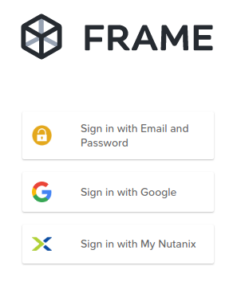

.. _clusteraccess:

----------------------
Accessing Your Cluster
----------------------

Clusters used for the **Hands on Labs** run within the Nuanix Hosted POC environment, hosted in the Nutanix PHX and RTP datacenters.

To ensure a consistent and manageable experience for all lab attendees, today's lab sessions will be using Nutanix Frame.  This allows us to run full desktops and applications within a browser session and without the need to install any software on your local laptops.

Labs
....

There are 3 labs listed in the index to the left.  They are provided for later reference only and are not explicitly required for labs run within Nutanix Frame.  They have been left in place for those that may wish to set up dedicated Linux or Windows test/development VMs later.

Frame Access
............

**By the time you attend Dev Day, you should have received an email that includes Nutanix Frame access instructions.  Please use the details in this email to login to Nutanix Frame.**

- **URL**: https://frame.nutanix.com
- **Option**: Sign in with Email and Password

- **Username**: See email
- **Password**: See email

Cluster/Hosted POC Credentials
..............................

In order to access the required resources you will be using a Nutanix-hosted cluster.

Continue to **Your Cluster Details** on the left side of this page to obtain cluster IP addresses information and credentials.